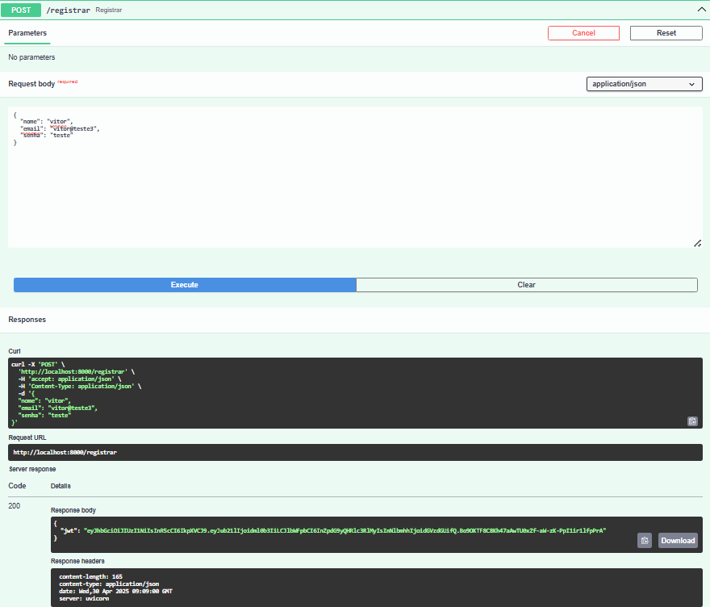
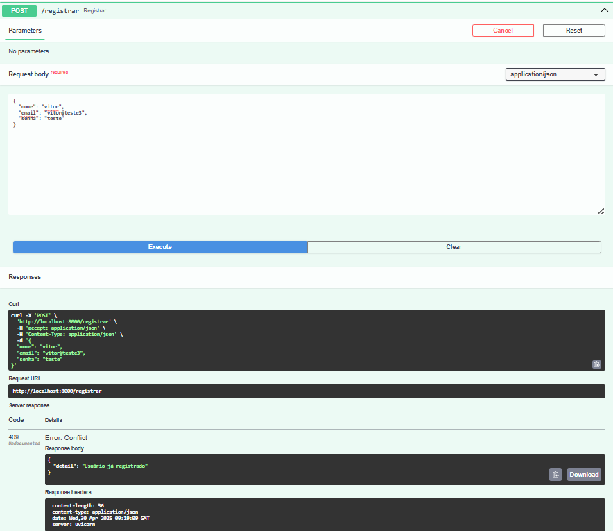
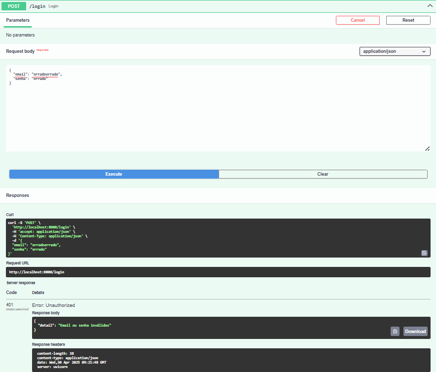
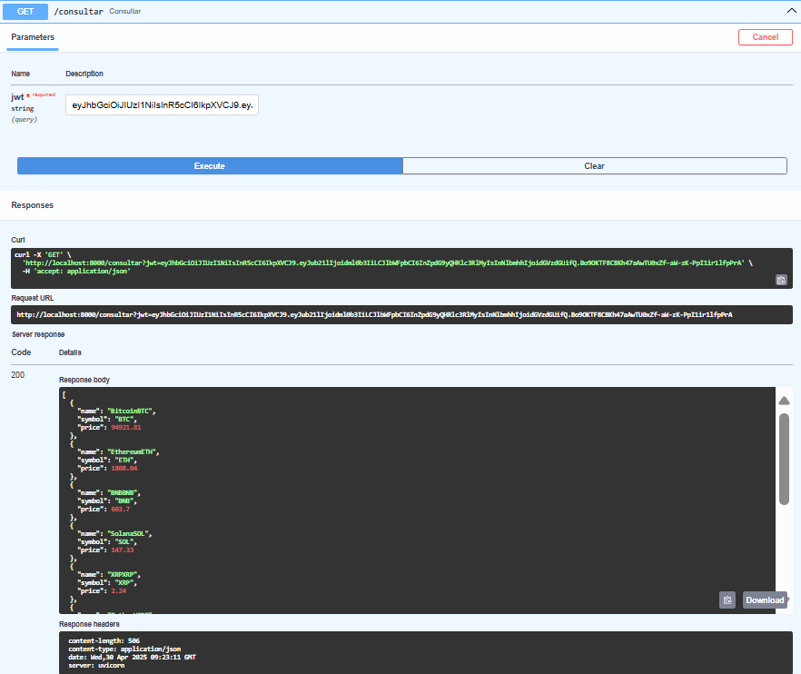
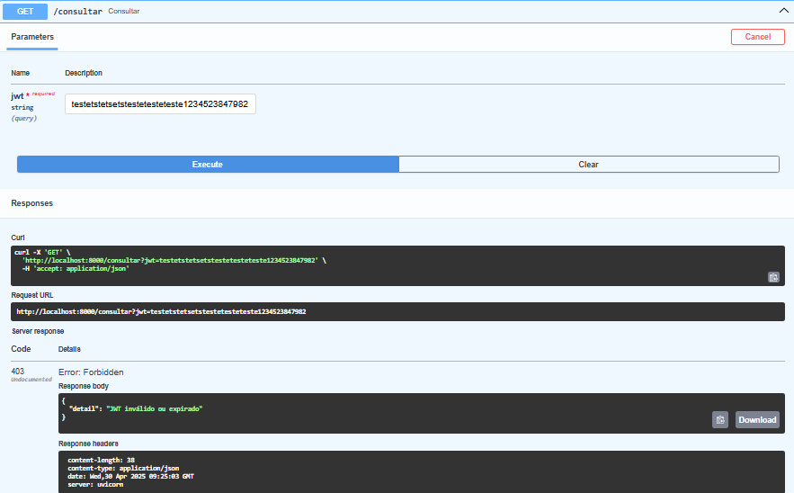

# Projeto Computação em Nuvem 2025.1
## Etapa 1

### 1.1 - Descrição do projeto
Este projeto consiste em uma API RESTful desenvolvida com FastAPI que realiza scraping de dados de criptomoedas, de uma fonte externa, e permite o acesso a essas informações por meio de endpoints documentados. A aplicação é containerizada com Docker, permitindo fácil execução e portabilidade.

O foco principal é viabilizar e verificar se será possível fazer a coleta e disponibilização de dados através de uma API que cadastra dados de usuários, com deploy simples e documentação acessível.

#### Integrantes do grupo
- Nome: Daniel Djanikian
- Nome: Vitor Padovani

#### Repositorio
- Link: [https://github.com/vitorpadovani/cloud_projeto](https://github.com/vitorpadovani/cloud_projeto)

### 1.2 - Scrap realizado
O scraping foi realizado na página [CoinMarketCap](https://coinmarketcap.com/), que fornece informações detalhadas sobre criptomoedas, incluindo preço, volume de negociação, capitalização de mercado e outras métricas relevantes. A coleta de dados foi feita utilizando a biblioteca BeautifulSoup para extrair as informações desejadas da página HTML. Além disso, foram utilizados os métodos `requests.Session()` para realizar as requisições HTTP e `BeautifulSoup` para parsear o conteúdo HTML obtido.

O scraping é realizado em um intervalo de alguns segundos entre as requisições, para evitar sobrecarga no servidor e respeitar as políticas de uso do site. Os dados coletados incluem o nome da criptomoeda e seu preço atual de mercado, sendo que no site, o preço é atualizado em tempo real, possibilitando a coleta de dados atualizados.

Para que seja possível realizar o scraping, é necessário que o usuário esteja cadastrado no sistema, o que é feito através de um endpoint específico. Após o cadastro, o usuário pode acessar os dados coletados por meio de outro endpoint, que retorna as informações em formato JSON.

### 1.3 - API RESTful
A API RESTful foi desenvolvida utilizando o framework FastAPI, que permite a criação de APIs de forma rápida e eficiente. A API possui os seguintes endpoints:

- `POST /registrar`: Cadastra um novo usuário no sistema.
- `POST /login`: Realiza o login de um usuário já cadastrado.
- `GET /consultar`: Retorna a lista das 10 criptomoedas mais valiosas, com nome e preço atual (em doláres) caso o usuário esteja autenticado.

Para cada endpoint, foram implementadas as seguintes funcionalidades:

- **Registrar**: O usuário deve fornecer um nome, email e senha. Todos são registrados na base de dados e retornará um token de autenticação JWT, em caso o cadastro seja realizado com sucesso.
- **Login**: O usuário deve fornecer email e senha. Caso as credenciais estejam corretas, um token JWT é retornado.
- **Consultar**: O usuário deve fornecer o token JWT obtido no cadastro ou login (sendo o mesmo em ambos). Caso o token seja válido, a API retorna uma lista de criptomoedas coletadas.

### 2.1 - Dockerização
A aplicação foi containerizada utilizando o Docker, permitindo que a API seja executada em qualquer ambiente que suporte Docker. O Dockerfile foi configurado para instalar as dependências necessárias e expor a porta 8000, onde a API está disponível.

Além disso, foi criado um arquivo `compose.yml`, que nele é utilizado apenas imagens do Docker Hub para facilitar a execução da aplicação, permitindo que o usuário inicie todos os serviços necessários com um único comando. Esse arquivo junta duas aplicações: a Aplicação FastAPI e o banco de dados Postgres, que armazena os dados dos usuários. Portanto ele se conecta com o banco de dados e realiza as operações de CRUD necessárias para o funcionamento da API.

Utilizando o Docker Desktop, é possível visualizar os containers em execução, monitorar logs e verificar criação dos usuários. Isso facilita o desenvolvimento e a manutenção da aplicação.

### 2.2 - Organização do projeto

api/
  Dockerfile
  app/
    main.py
  requirements.txt
compose.yaml
.env
.gitignore
README.md

### 2.3 - Arquivos chaves
- **compose.yaml**:
```bash
version: '3.9'

services:

  api:
    image: minha-api
    restart: always
    ports:  
      - 8000:8000
    depends_on:
      - db
    environment:
      DATABASE_URL: ${DATABASE_URL:-postgresql://usuario:cloudteste123@db:5432/meu_banco}
    command: uvicorn app.main:app --host 0.0.0.0 --port 8000

  db:
    image: postgres
    hostname: db
    restart: always
    environment:
      POSTGRES_USER: ${MEUUSUARIO:-usuario}
      POSTGRES_PASSWORD: ${MINHASENHADB:-cloudteste123}
      POSTGRES_DB: ${POSTGRES_BANCO:-meu_banco}
```

**OBS**: O arquivo `.env` contém as variáveis de ambiente utilizadas no `compose.yaml`, como `DATABASE_URL`, `MEUUSUARIO`, `MINHASENHADB` e `POSTGRES_BANCO`. Essas variáveis são utilizadas para configurar o banco de dados Postgres e a conexão com a API. Para um ambiente de produção, é importante garantir que essas variáveis estejam configuradas corretamente e que as senhas sejam mantidas em segredo, porém aqui no projeto, elas estão expostas para facilitar o entendimento do funcionamento do projeto.

### 2.4 - Docker Hub

O projeto foi publicado no Docker Hub, permitindo que qualquer pessoa possa baixar e executar a aplicação facilmente. O repositório contém as imagens necessárias para executar a aplicação, facilitando o compartilhamento e a colaboração entre desenvolvedores.

Esse processo de publicação no Docker Hub foi realizado através da criação de uma conta no Docker Hub, login na conta através do terminal, construção da imagem com o comando `docker tag minha-api vitorpadova/projeto_cloud` e o push da imagem para o repositório com o comando `docker push vitorpadova/projeto_cloud`.

O repositório do Docker Hub pode ser acessado através do seguinte link: [https://hub.docker.com/r/vitorpadova/projeto_cloud](https://hub.docker.com/r/vitorpadova/projeto_cloud).


### 3.1 - Execução do projeto

Para executar o projeto, siga os seguintes passos:
1. Certifique-se de ter o Docker instalado em sua máquina.

2. Clone o repositório do projeto:
```bash
git clone https://github.com/vitorpadovani/cloud_projeto.git
cd cloud_projeto
```

3. Crie um ambiente virtual e ative-o (opcional, mas recomendado):
```bash
python -m venv venv
source venv/bin/activate  # Linux/Mac
venv\Scripts\activate  # Windows
```

4. Instale as dependências do projeto:
```bash
pip install -r api/requirements.txt # Caso esteja na raiz do projeto
```

5. Inicie os containers utilizando o Docker Compose:
```bash
docker-compose up -d
```
Isso iniciará os containers da API e do banco de dados em segundo plano.

6. Acesse a API em `http://localhost:8000/docs` para visualizar a documentação gerada automaticamente pelo FastAPI.
7. Para testar os endpoints, você pode usar ferramentas do próprio `/docs`. A documentação da API também fornece exemplos de como fazer as requisições.

8. Para parar os containers, utilize o seguinte comando:
```bash
docker-compose down
```
Isso encerrará os containers e liberará os recursos utilizados.

### 3.2 - Testes
Os testes das funcionalidades da API foram realizados justamente utilizando a documentação gerada pelo FastAPI, que não fornece uma interface mas é bom para testar os endpoints. Os testes foram realizados com sucesso, validando o funcionamento correto da API.

Os testes realizados foram:

- Cadastro de usuário: Verificamos se o usuário foi cadastrado corretamente e se o token JWT foi gerado.


/// caption
Teste Registro de Usuário com sucesso
///

- Cadastro de usuário já existente: Verificamos se o cadastro retornou erro 409 quando o usuário já estava cadastrado.


/// caption
Teste Cadastro de Usuário já existente com erro
///


- Login de usuário: Verificamos se o login foi realizado corretamente e se o token JWT foi gerado.


/// caption
Teste Login de Usuário com sucesso
///

- Login de usuário incorreto: Verificamos se o login retornou erro 401 quando o usuário não estava cadastrado ou se errou o email/senha.


/// caption
Teste Login de Usuário incorreto com erro
///

- Consulta de criptomoedas: Verificamos se a consulta retornou as 10 criptomoedas mais valiosas com sucesso, utilizando o token JWT gerado no cadastro ou login.


/// caption
Teste Consulta de Criptomoedas com sucesso
///

- Consulta de criptomoedas sem autenticação: Verificamos se a consulta retornou erro 403 quando o usuário não estava autenticado.


/// caption
Teste Consulta de Criptomoedas sem autenticação
///

### 3.3 - Video de execução da aplicação

O video a seguir mostra a execução da aplicação, com um cadastro de um usuário. Além disso, também mostra a execução desse usuário entrando na Base de dados e o Docker, portanto, a visualização dos containers em execução.

- [Link do video](https://youtu.be/Zixz8pPbRB4)

### 4.1 - Conclusão
O projeto foi desenvolvido com sucesso, atendendo aos requisitos propostos. A API foi implementada utilizando o FastAPI, permitindo a criação de endpoints para cadastro e consulta de criptomoedas. O scraping foi realizado com sucesso, coletando dados atualizados do site CoinMarketCap.
A aplicação foi containerizada com Docker, facilitando a execução e portabilidade. Os testes realizados validaram o funcionamento correto da API, garantindo que todas as funcionalidades estão operando conforme o esperado.
Por fim, o projeto foi publicado no Docker Hub, permitindo que qualquer pessoa possa baixar e executar a aplicação facilmente.

Portanto conseguimos desenvolver conceitos como por exemplo:
- Containerização local com Docker Compose
- Criação de uma API RESTful com FastAPI
- Scraping de dados de uma fonte externa
- Armazenamento de dados em um banco de dados Postgres
- Autenticação de usuários com JWT
- Documentação da API com Swagger
- Testes de funcionalidades da API utilizando a documentação gerada pelo FastAPI

### 4.2 - Referências
- [Site da Disciplina](https://insper.github.io/computacao-nuvem/)
- [FastAPI](https://fastapi.tiangolo.com/)
- [Docker](https://www.docker.com/)
- [Docker Hub](https://hub.docker.com/)
- [Postgres](https://hub.docker.com/_/postgres)
- [Video Tutorial Docker Hub](https://www.youtube.com/watch?v=iqqDU2crIEQ&t=1002s)
- [CoinMarketCap](https://coinmarketcap.com/)
