## Objetivo

O principal objetivo deste roteiro é aprender a configurar um ambiente de cloud bare-metal. Durante o processo, serão abordados os seguintes pontos:

Configuração de Infraestrutura: Montar a subrede para comunicação entre os servidores, configurando o ambiente com Ubuntu e utilizando o MaaS para gerenciar o hardware e a rede.

Implantação e Integração de Serviços: Realizar a instalação e configuração de serviços essenciais, como o banco de dados PostgreSQL e a aplicação Django, incluindo a implementação de deploy manual e automatizado com Ansible.

Implementação de Conectividade e Balanceamento de Carga: Configurar roteadores, DHCP e proxy reverso com NGINX para assegurar a conectividade interna/externa e distribuir a carga entre os servidores.

## Material Utilizado
1 NUC (main) com 10Gb e 1 SSD (120Gb)

1 NUC (server1) com 12Gb e 1 SSD (120Gb)

1 NUC (server2) com 16Gb e 2 SSD (120Gb+120Gb)

3 NUCs (server3, server4 e server5) com 32Gb e 2 SSD (120Gb+120Gb)

1 Switch DLink DSG-1210-28 de 28 portas

1 Roteador TP-Link TL-R470T+

## Criando e Usando a Infraestrutura

O objetivo desta etapa é preparar a rede física e lógica, garantindo que todos os NUCs estejam na mesma subrede e tenham acesso à rede externa via roteador. Uma máquina principal, chamada de main, será configurada com o MaaS para gerenciar todas as demais máquinas. A seguir, os passos realizados:

### 1. Conexão dos Dispositivos e Instalação do Ubuntu Server

- **Conexão Física:**  
  Todos os NUCs e o roteador são conectados ao switch, formando a base da rede local.

- **Instalação do Sistema Operacional:**  
  No NUC principal (main), instalamos o Ubuntu Server 22.04.5 LTS para garantir estabilidade e compatibilidade.  
  - Configuramos um IP estático para assegurar o acesso remoto contínuo e evitar mudanças dinâmicas que poderiam comprometer a comunicação.


- **Instalação do MaaS:**  
  Utilizamos o MaaS (versão 3.5) para orquestrar e gerenciar o hardware do NUC main.  
``` bash
sudo snap install maas --channel=3.5/Stable
```
- **Configuração Inicial do MaaS:**  
  - Inicializamos o MaaS com a URL e o banco de dados de teste.  
  ``` bash
  sudo maas init region+rack --maas-url http://172.16.0.3:5240/MAAS --database-uri maas-test-db:///
  ```
  - Criamos o administrador utilizando o login **cloud** e a senha padrão da disciplina.  
  - Habilitamos o acesso remoto via **SSH** para facilitar a administração (veja a seção de SSH abaixo).  
  - Acessamos o Dashboard do MaaS pelo endereço `http://172.16.0.3:5240/MAAS` e importamos as imagens do Ubuntu (22.04 LTS e 20.04 LTS), para poderem ser utilizadas na instalação das outras NUCs.  
  - Configuramos o DNS Forwarder para utilizar o DNS externo do Insper.  
  - Em **Settings | General**, ajustamos os parâmetros do kernel, definindo `net.ifnames=0`.

- **Configuração do DHCP no MaaS:**
  - Como o switch não tem o serviço DHCP, ou seja, ele não consegue entregar IPs aos dispositivos na rede, vamos utilizar o roteador para isso.
  - Habilitamos o DHCP na subrede configurada pelo MaaS Controller e ajustamos o Reserved Range para iniciar em 172.16.11.1 e terminar em 172.16.14.255, dentro da sub-rede definida pela máscara 255.255.240.0. Essa configuração permite que os endereços atribuídos pelo DHCP fiquem restritos a uma parte do espaço de endereçamento disponível, ajudando a controlar e organizar os acessos dentro da rede.  
  - Desabilitamos o DHCP no roteador, para que o MaaS seja o responsável pela distribuição dos IPs.

- **Verificações de Conectividade:**  
  Validamos a configuração de rede realizando pings para `8.8.8.8` e `www.google.com`, assegurando que o roteamento dos pacotes e a resolução de URLs estejam funcionando corretamente.

#### O que é o SSH e como ele foi Configurado

**SSH (Secure Shell)** é um protocolo que permite o acesso remoto seguro a sistemas, criando um canal criptografado entre o cliente e o servidor. Isso garante que as informações transmitidas, como comandos e credenciais, estejam protegidas contra interceptações.

1. **Geração do Par de Chaves:**  
   Utilizamos `ssh-keygen -t -rsa` para criar um par de chaves (pública e privada), permitindo a autenticação sem a necessidade de enviar senhas em texto claro.

2. **Distribuição da Chave Pública:**  
   A chave pública gerada foi copiada para o servidor (NUC **main**), possibilitando que o servidor autentique o cliente que possui a chave privada correspondente.
Vale ressaltar que esse serviço do ssh trabalha na porta 22.

### 3. Comissionamento dos Servidores e Criação de OVS Bridge

- **Comissionamento dos Servidores:**  
  No Dashboard do MaaS, cadastramos os hosts (server1 até server5) e configuramos a opção de Power Type para Intel AMT. Foram inseridos os seguintes detalhes:  
  - MAC Address (anotado previamente).  
  - Senha padrão: `CloudComp6s!`.  
  - IP do AMT, no formato `172.16.15.X` (onde X corresponde ao id do servidor, por exemplo, server1 = 172.16.15.1).  
  Após o boot via PXE, os servidores devem aparecer com o status "Ready", indicando que os parâmetros de hardware (CPU, memória, SSD e rede) foram detectados corretamente.  
  Também adicionamos o roteador como device no Dashboard do MaaS.

  Obs: O server 1 da nossa cloud estava enfrentando problemas para ser encontrado. Como esse roteiro não necessitava a utilização de todos os servers, seguimos utilizando os demais.

- **Criação de OVS Bridge:**  
  Para reduzir a necessidade de duas interfaces de rede físicas, configuramos uma Open vSwitch (OVS) bridge.  
  - A ponte é criada a partir da interface padrão `enp1s0` e nomeada **br-ex**.  
  - Essa configuração é aplicada em todos os cinco nós, garantindo flexibilidade e suporte ao OVN Chassis.

### 4. Configuração de NAT e Acesso Remoto

#### O que é NAT?
O NAT (Network Address Translation) é uma técnica que permite que dispositivos de uma rede privada compartilhem um único endereço IP público para acessar a internet. Ele realiza a tradução dos endereços IP privados para um endereço público e vice-versa, garantindo que os pacotes de dados sejam direcionados corretamente entre a rede interna e a externa.

#### Como o NAT Funciona na Nossa Configuração
- **Tradução de Endereços:**  
  Cada dispositivo na rede local possui um endereço IP privado (por exemplo, na faixa 172.16.0.0/20). Quando um dispositivo envia dados para a internet, o roteador que realiza o NAT substitui o endereço IP privado pelo endereço IP público configurado. Dessa forma, o tráfego de saída parece originar de um único IP público.
  

- **Port Forwarding para Acesso Remoto:**  
  Para permitir a conexão remota ao servidor principal (**main**) pela porta 22, configuramos um redirecionamento de porta (port forwarding). Isso faz com que qualquer conexão que chegue à porta 22 do endereço IP público seja encaminhada para o IP fixo do servidor **main** (172.16.0.3).

#### Configuração do NAT e das Regras de Gerenciamento no Roteador
- **Acesso à Interface do Roteador:**  
  A configuração é realizada através da interface administrativa do roteador, geralmente acessível via navegador através do IP do dispositivo.

- **Definição das Regras de NAT:**  
  Na interface do roteador, configuramos as seguintes regras:
    1. **Regra de NAT:** Define que todos os dispositivos da subrede (172.16.0.0/20) usem o endereço IP público do roteador para acessar a internet.
    2. **Port Forwarding:** Cria uma regra para redirecionar conexões que chegam na porta 22 para o IP 172.16.0.3, permitindo o acesso remoto seguro ao servidor **main**.

    3. **Regras de Gerenciamento Remoto:**  
    Adicionalmente, foi criada uma regra que permite o acesso remoto ao próprio roteador (regra de gestão), configurada para aceitar conexões de qualquer endereço (0.0.0.0/0). Essa regra possibilita a administração do roteador remotamente.

Essa configuração garante que a rede local tenha acesso à internet por meio de um único endereço IP público, ao mesmo tempo que permite o gerenciamento remoto seguro tanto do servidor **main** quanto do roteador.


## Bare Metal - Aplicação

Nesta etapa, realizamos o deploy manual de uma aplicação simples em Django utilizando a infraestrutura configurada anteriormente na nuvem MaaS. É importante notar que, devido a problemas técnicos, o server originalmente designado como "server1" não funcionou corretamente. Dessa forma, o servidor que inicialmente seria o server1 passou a ser considerado como server2, o que acarretou um reajuste na numeração dos demais servidores (server2 passou a ser server3, e assim por diante).

Além disso, durante a instalação das imagens nos servidores, encontramos um problema inesperado: a Canonical atualizou a imagem do Ubuntu, alterando algum componente essencial e rompendo a compatibilidade. Para resolver esse problema, foi necessário atualizar o firmware em todas as máquinas para que o Ubuntu 22.04 funcionasse corretamente.

### 1. Ajuste no DNS do Servidor
Antes de iniciar o deploy, foi preciso ajustar a configuração do DNS:

- Acesse a aba **Subnets** no MaaS e edite a subnet `172.16.0.0/20`, alterando o campo Subnet summary para usar o DNS do Insper (`172.20.129.131`).

### 2. Primeira Parte: Configuração do Banco de Dados
Utilizamos o PostgreSQL, um servidor de banco de dados robusto e amplamente utilizado em projetos open source, conforme os passos abaixo:

- **Deploy do Ubuntu:**  
  No MaaS, foi realizado o deploy do Ubuntu 22.04 no servidor designado (que originalmente seria o server1, mas considerando o ajuste, este é agora o server2).
- **Instalação e Configuração do PostgreSQL:**  
  No terminal do servidor (acessado via SSH), executamos os seguintes procedimentos:
  - Atualização do sistema.
  ``` bash
  sudo apt update
  ```
  - Instalação dos pacotes do PostgreSQL e suas contribuições.
  ```bash
  sudo apt install postgresql postgresql-contrib -y
  ```
  - Criação de um usuário para a aplicação (usuário `cloud` com senha `cloud`).
  ```bash
  sudo su - postgres
  createuser -s cloud -W
  ```
  - Criação de uma base de dados (por exemplo, `tasks`).
  ```bash
  createdb -O cloud tasks
  ```
  - Edição do arquivo de configuração do PostgreSQL para que o serviço aceite conexões remotas (definindo `listen_addresses = '*'`).
  ```bash
  nano /etc/postgresql/14/main/postgresql.conf
  ```
  - Ajuste no arquivo de controle de acesso (`pg_hba.conf`) para liberar conexões vindas da subnet `172.16.0.0/20`.
  - Liberação da porta (5432) no firewall e reinicialização do serviço.
  ```bash
  sudo ufw allow 5432/tcp
  sudo systemctl restart postgresql
  ```
### Tarefa 1
Verificando se o banco está funcionando

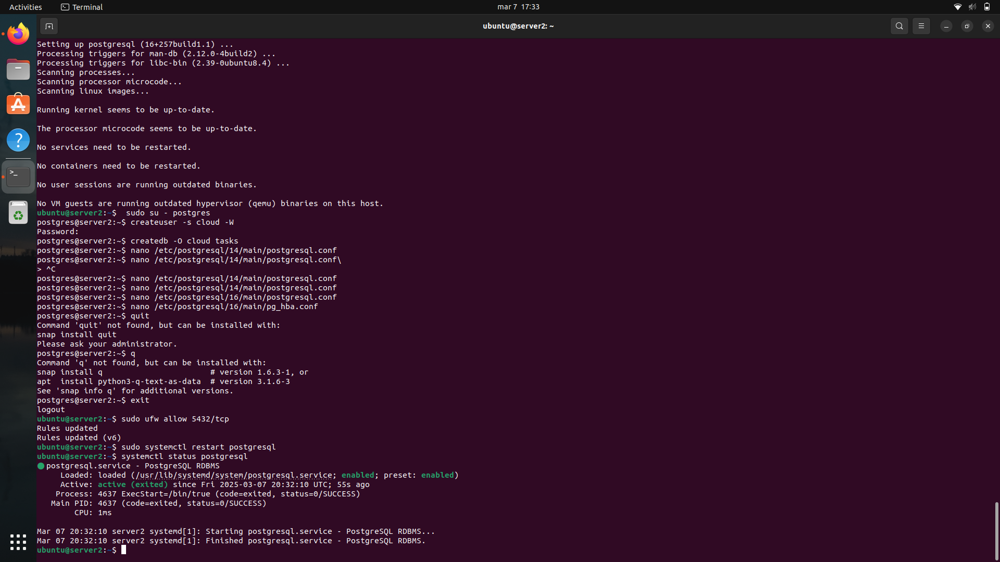
/// caption
Funcionando e seu Status está como "Ativo" para o Sistema Operacional
///

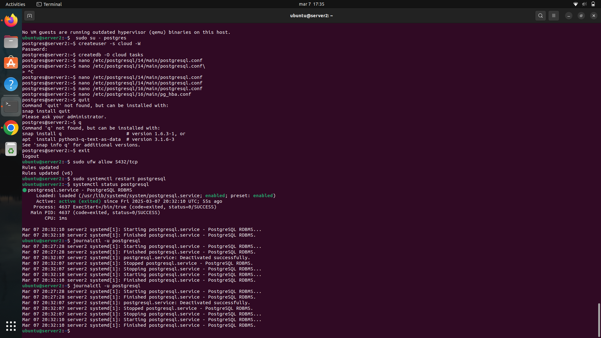
/// caption
Verifica se iniciou sem erro 
///


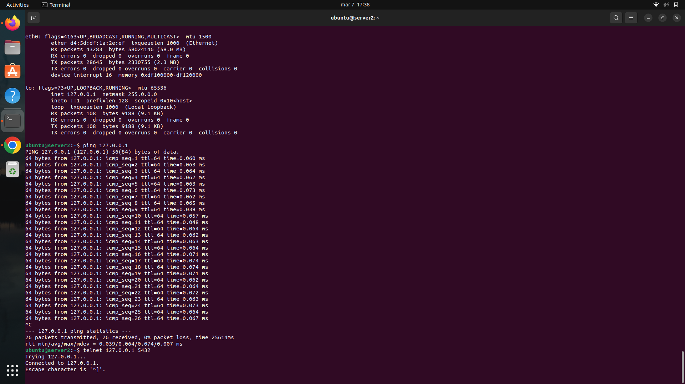
/// caption
Acessivel na própria maquina na qual ele foi implantado
///

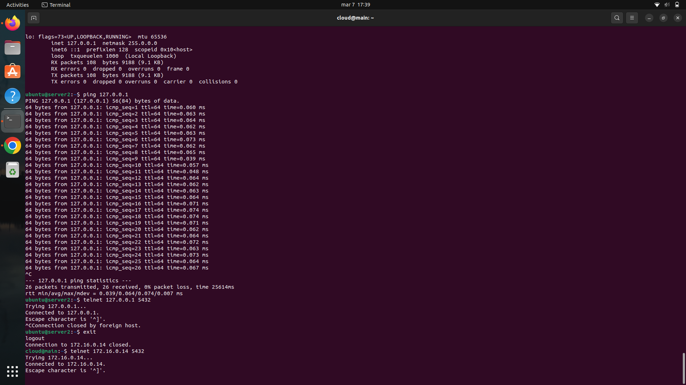
/// caption
Acessivel a partir de uma conexão vinda da máquina MAIN na porta 5432.
///


### 3. Parte II: Deploy da Aplicação Django

- **Reserva e Deploy da Máquina:**  
  Utilizando o MaaS CLI, reservamos uma máquina (originalmente designada como server2, mas, com o ajuste, ela se torna o novo server3 conforme a sequência), e realizamos o deploy através do CLI do MaaS. Vale ressaltar que, por conta do problema com a imagem, tivemos que refazer todos os deploys manualmente pelo MaaS.
- **Clone e Instalação da Aplicação: VERIFICAR SE AINDA NECESSITA TER**  
  Acessamos o servidor via SSH, clonamos o repositório da aplicação Django e executamos o script de instalação (`install.sh`).
  ```bash
  maas [login] machine deploy [system_id]
  git clone https://github.com/raulikeda/tasks.git
  ./install.sh
  sudo reboot
  ```

  - **Instalando e configurando o Django (Parte da Tarefa 3):**
  
    Após o deploy manual da nossa máquina, por conta do erro, para baixar a aplicação do Django, entramos no server3 e rodamos os seguintes comandos para instalar o Django:
    ```bash
    sudo apt install python3-psycopg2
    pip install django --break-system-packages 
    ```
    Além disso, para a aplicação funcionar, modificamos o arquivo `settings.py` do Django para indicar que o banco de dados que iremos utilizar estará no server2 e ajustamos os `ALLOWED_HOSTS` para permitir o acesso sem problemas a partir do main.
    ```bash
    nano portfolio/settings.py 
    ```
    
  - **Fazendo com que o server3 Enxergue o server2**

    Como apenas o servidor **main** consegue visualizar todas as máquinas (devido à sua função de controlador do MaaS), precisamos informar o server3 sobre a localização do server2, que hospeda o PostgreSQL para a aplicação Django. Para isso, editamos o arquivo `/etc/hosts` no server3 e adicionamos uma entrada que associa o nome ("server2") ao respectivo endereço IP.

    Essa ação garante que, mesmo sem acesso direto à tabela de DNS da rede, o server3 consiga resolver o nome do server2 e estabelecer comunicação com ele. Além disso, desabilitamos a configuração para que essa alteração não seja perdida após uma reinicialização.
    ```bash
    sudo nano /etc/hosts 
    ```
  
  **Teste da Aplicação:**  
  Após reiniciar a máquina, testamos o acesso à aplicação via terminal do MaaS utilizando um comando para verificar a porta 8080.
  ```bash
  wget http://[IP server3]:8080/admin/
  ```  
  Para acesso no browser, criamos um túnel SSH redirecionando a porta 8080 do servidor para a porta 8001 local.
  ```bash
  ssh cloud@10.103.0.X -L 8001:[IP server3]:8080
  ```
Esse túnel faz com que utilizemos a porta 8001 do computador local para acessar o que está na porta 8080 do server3. Isso significa que qualquer solicitação feita para http://localhost:8001/admin/ será redirecionada para http://server2:8080/admin/. Dessa forma, podemos acessar a interface de administração do django do server3 localmente através do navegador web.

### Tarefa 2

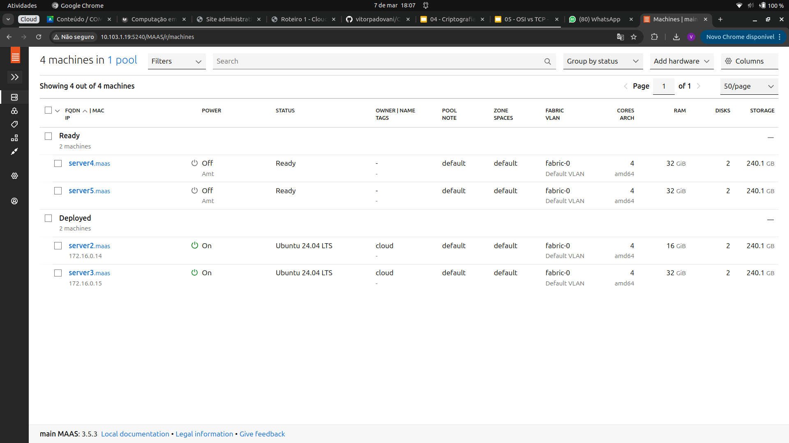
/// caption
Dashboard do MAAS com Server 2 e 3 deployados
///

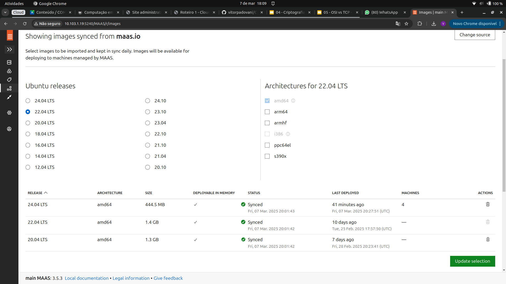
/// caption
Comprovação das imagens do Ubuntu sincronizadas
///


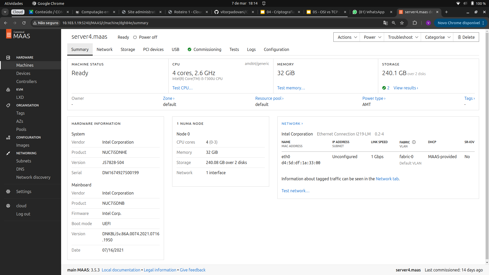

/// caption
Todas as máquinas passaram nos testes de hardware e commissioning com status "OK"
///

### Tarefa 3


/// caption
Dashboard do MAAS com os IPS das máquinas
///


/// caption
Aplicação django rodando no server3
///


/// caption
Comprovando que estamos rodando no server3
///


### 4. Deploy Automatizado com Ansible

O Ansible é uma ferramenta de automação que permite gerenciar configurações e implantações de forma padronizada e repetível. Diferente do processo manual, ele garante que os passos de instalação sejam executados da mesma forma em todas as máquinas, sem interferir em estados intermediários – um conceito conhecido como idempotência.

#### O Que Acontece Durante o Deploy Automatizado?

1. **Provisionamento da Máquina de Destino:**  
   Após solicitar o deploy via MaaS, uma nova máquina (agora designada como server4) é alocada para a aplicação.

2. **Instalação do Ansible no Servidor Principal:**  
   Instalamos o Ansible no servidor principal (**main**). Isso transforma o main em um controlador central que se conecta às máquinas remotas para executar os comandos necessários.
   ```bash
   sudo apt install ansible
   ```
3. **Baixar o Playbook:**  
   Um playbook é um arquivo YAML que contém uma série de instruções (ou "tasks") que definem como a aplicação Django deve ser instalada e configurada. Ao baixar esse arquivo, garantimos que todos os passos necessários serão executados de forma padronizada.
   ```bash
   wget https://raw.githubusercontent.com/raulikeda/tasks/master/tasks-install-playbook.yaml
   ```

4. **Execução do Playbook:**  
   Com o playbook em mãos, utilizamos o comando do Ansible para executá-lo, passando o IP do server4 como variável extra. Esse processo automatiza a instalação da aplicação Django, realizando as mesmas ações que seriam feitas manualmente (como instalação de pacotes, configuração de serviços e deploy da aplicação), mas sem a necessidade de intervenção manual em cada servidor.
   ```bash
   ansible-playbook tasks-install-playbook.yaml --extra-vars server=[IP server4]
   ```
5. **Fazendo com que o server4 enxergue o server2**
  Seguindo o mesmo processo feito para o server3, devemos fazer para o server4 enxergar o server2. Para isso entramos nas configuraçÕes do `/etc/hosts` no server3 e adicionamos uma entrada que associa o nome ("server2") ao respectivo endereço IP.

#### Por Que Usar o Ansible?

- **Idempotência:**  
  O Ansible garante que, mesmo se executarmos o playbook múltiplas vezes, o sistema sempre alcançará o estado desejado, sem efeitos colaterais indesejados.

- **Gerenciamento Simultâneo de Várias Máquinas:**  
  Permite que um único playbook seja aplicado a múltiplos servidores de uma vez, garantindo uniformidade na instalação e configuração da aplicação.

- **Facilidade de Automação:**  
  Com um arquivo de configuração centralizado, qualquer alteração ou correção pode ser aplicada de maneira rápida e consistente em todos os nós.

- **Redução de Erros Humanos:**  
  Automatizando o processo, minimizamos a chance de erros que podem ocorrer durante a configuração manual de cada servidor.

### Tarefa 4

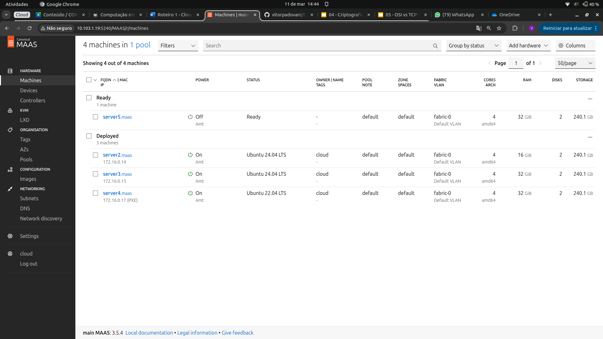
/// caption
Dashboard do MAAS com as 3 Maquinas e seus respectivos IPs
///


/// caption
Aplicação django rodando no server3
///


/// caption
Comprovando que estamos rodando no server3
///

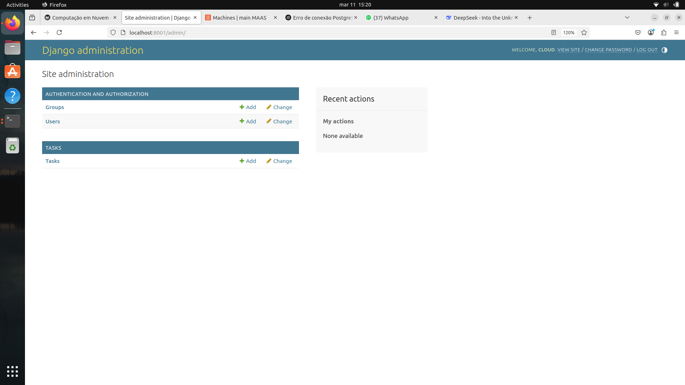
/// caption
Aplicação django rodando no server4
///

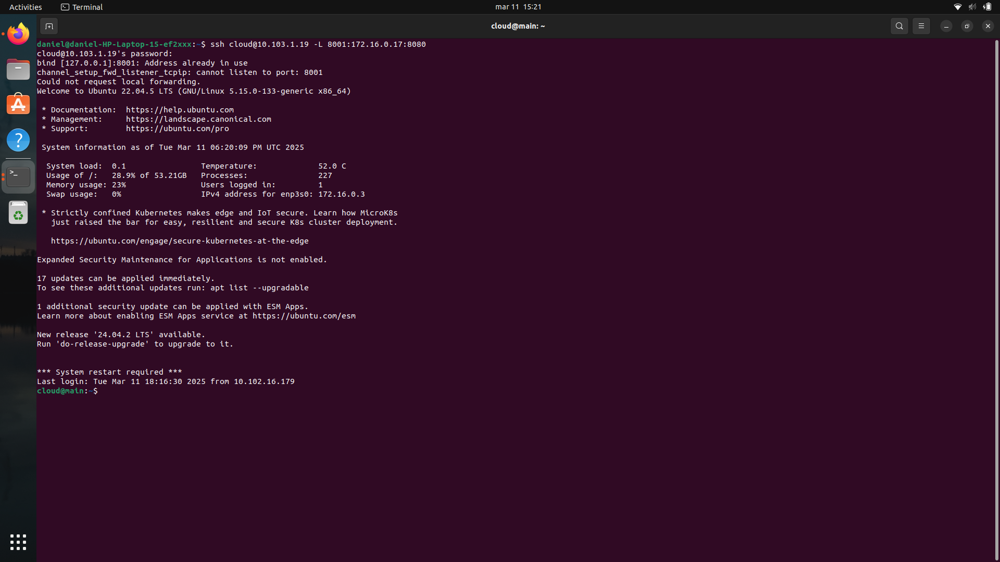
/// caption
Comprovando que estamos rodando no server4
///

A diferença entre instalar manualmente a aplicação Django e utilizar o Ansible é que, na instalação manual, cada comando deve ser executado individualmente em cada servidor, o que aumenta o risco de erros e pode resultar em configurações inconsistentes. Já com o Ansible, um playbook automatiza todo o processo, garantindo que os mesmos passos sejam aplicados de forma idêntica em todos os nós, tornando o deploy mais rápido, confiável e escalável, além de reduzir significativamente a possibilidade de erros humanos.

### 5. Balancamento de Carga com Proxy Reverso

O balanceamento de carga com proxy reverso tem como objetivo centralizar o acesso à aplicação, de forma que uma única entrada redirecione as requisições para vários servidores que hospedam a aplicação Django. Essa abordagem é essencial para garantir **alta disponibilidade** e **redundância**: se um dos servidores falhar, os outros continuam atendendo as requisições, mantendo a estabilidade do serviço.

Nesse cenário, instalamos o **NGINX** no **server5** para atuar como proxy reverso. O primeiro passo é instalar o NGINX, utilizando o gerenciador de pacotes do sistema:

```bash
sudo apt-get install nginx
```

Após a instalação, editamos o arquivo de configuração do NGINX, localizado em `/etc/nginx/sites-available/default`. Nele, definimos o bloco *upstream* que aponta para os servidores backend onde a aplicação Django está rodando:

~~~
upstream backend { server IP SERVER3:8080; server IP SERVER4:8080; }
~~~

Em seguida, configuramos o servidor virtual para encaminhar todas as requisições que chegarem na porta 80 para o grupo de servidores definido acima, utilizando a diretiva `proxy_pass`:

~~~
server { location / { proxy_pass http://backend; } }
~~~

Além disso comentamos algumas linhas para que não houvesse conflitos das informaçÕes.

Após todas as configuraçÕes realizadas no nginx, reiniciamos o serviço

```bash
sudo service nginx restart
```

A partir deste momento, o NGINX distribuirá as requisições recebidas entre os servidores definidos no bloco *upstream*, utilizando o algoritmo Round Robin por padrão. Isso melhora a **escalabilidade** e a **tolerância a falhas**, pois se um dos servidores ficar indisponível, o outro continuará atendendo às requisições.

Para verificar o funcionamento, modificamos a função `index` do arquivo `tasks/views.py` em cada instância da aplicação Django, atribuindo mensagens distintas. Assim, ao acessar a aplicação por meio do **server5**, podemos observar que as respostas alternam entre as mensagens, confirmando que o balanceamento de carga está ativo e direcionando as requisições para cada servidor de forma rotativa.


### Tarefa 5

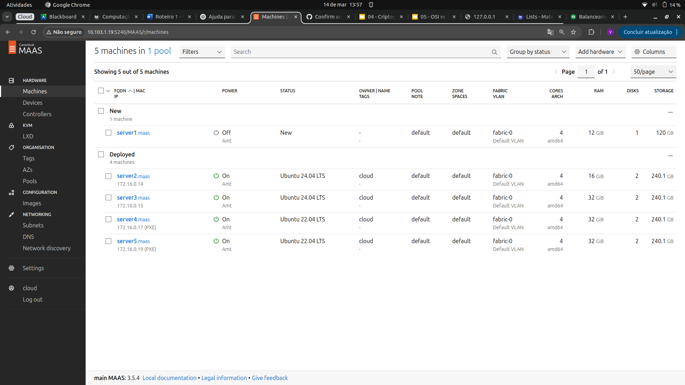
/// caption
Dashboard do MAAS com as 4 Maquinas e seus respectivos IPs
///

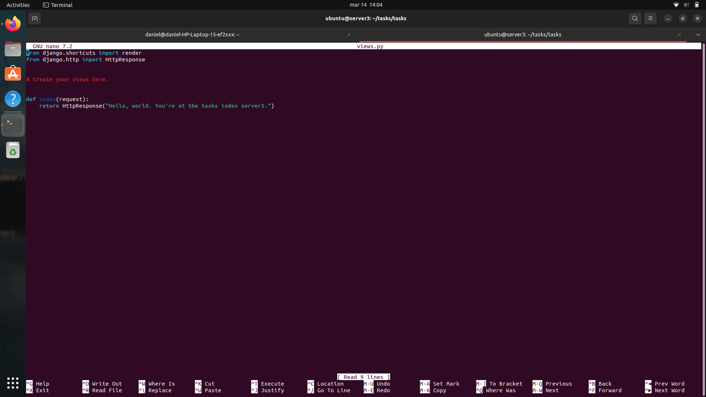
/// caption
Mudança da mensagem no views.py server3
///


/// caption
Mudança da mensagem no views.py server4
///


/// caption
Requisição com print da mensagem do server3
///

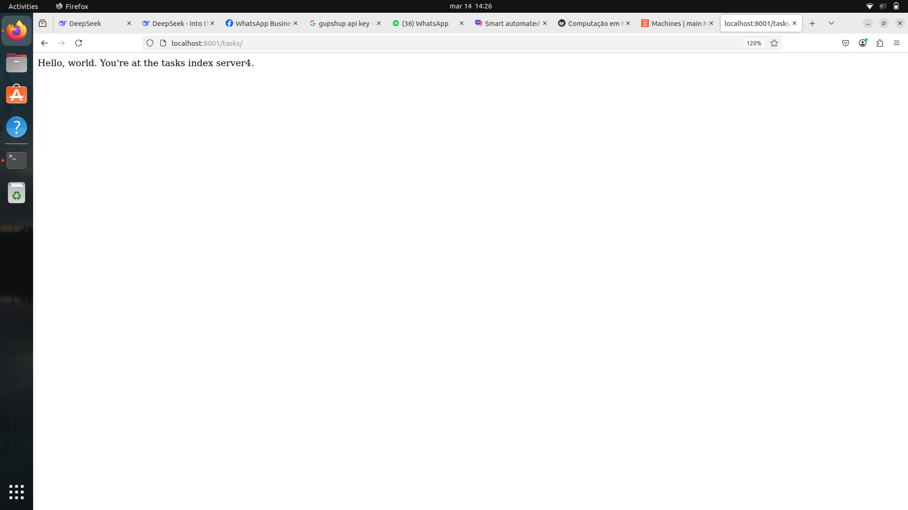
/// caption
Requisição com print da mensagem do server4
///


<!-- ### Tarefa 1

Instalando o MAAS:

<!-- termynal -->


<!-- 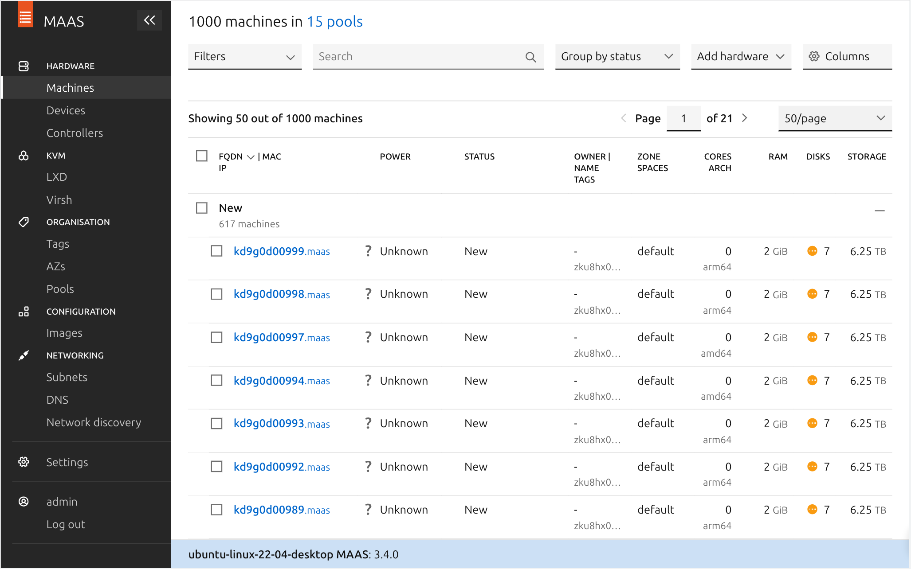
/// caption
Dashboard do MAAS
///

Conforme ilustrado acima, a tela inicial do MAAS apresenta um dashboard com informações sobre o estado atual dos servidores gerenciados. O dashboard é composto por diversos painéis, cada um exibindo informações sobre um aspecto específico do ambiente gerenciado. Os painéis podem ser configurados e personalizados de acordo com as necessidades do usuário.

### Tarefa 2

## App


### Tarefa 1

### Tarefa 2

Exemplo de diagrama

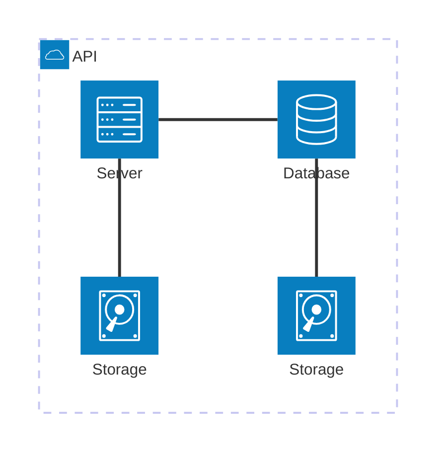

[Mermaid](https://mermaid.js.org/syntax/architecture.html){:target="_blank"}

## Questionário, Projeto ou Plano

Esse seção deve ser preenchida apenas se houver demanda do roteiro. --> 

## Discussões

Durante a configuração e implementação da nuvem bare-metal, surgiram diversos pontos de discussão e aprendizado:

- **Configuração de Rede e MaaS**: Embora o MaaS simplifique a orquestração de hardware, entender sua lógica de DHCP e a interação com o roteador demandou um tempo considerável. O fato de o switch não possuir DHCP embutido exigiu atenção redobrada na definição dos endereços IP e no desvio de funções do roteador para o MaaS.  

- **Problemas Técnicos e Soluções**: A indisponibilidade do servidor que originalmente seria o *server1* mostrou a importância de ter planos de contingência. O ajuste na numeração dos servidores e a atualização de firmware para corrigir a compatibilidade com o Ubuntu 22.04 demonstram como ambientes de produção podem exigir adaptações e reconfigurações inesperadas.

- **Instalação Manual vs. Ansible**: A instalação manual do Django e do banco de dados PostgreSQL, embora didática para fins de aprendizado, revelou-se propensa a erros e repetições. Em contrapartida, o uso do Ansible permitiu automatizar a configuração de múltiplos servidores de forma consistente, evidenciando a escalabilidade e a confiabilidade proporcionadas pelas ferramentas de automação.

- **Balanceamento de Carga**: Configurar o NGINX como proxy reverso enfatizou a importância de uma única entrada de acesso para distribuir requisições entre vários servidores. Esse passo é fundamental para garantir alta disponibilidade, especialmente em cenários de produção que exigem redundância e escalabilidade.

- **Dificuldades e Facilidade**: A maior dificuldade relatada foi lidar com ajustes de firmware e versões de imagem que mudaram subitamente. Já a maior facilidade percebida foi a automação do deploy com Ansible, que simplificou a replicação das configurações e reduziu erros humanos.

## Conclusão

A realização deste roteiro proporcionou uma visão completa do processo de criação e gestão de uma nuvem bare-metal. Iniciando pela configuração da infraestrutura de rede e passando pela instalação manual de serviços críticos como o PostgreSQL e o Django, o aprendizado foi consolidado ao automatizar tarefas com Ansible e ao implementar um balanceador de carga via NGINX.

No final, foi possível concluir que:

1. **Gerenciamento Centralizado é Essencial**: O MaaS demonstrou ser uma ferramenta valiosa para orquestrar o provisionamento e o controle de múltiplos servidores, otimizando a alocação de recursos e o gerenciamento de IPs.

2. **Automação Reduz Erros e Garante Consistência**: A diferença entre instalar serviços manualmente e utilizar o Ansible evidenciou o quanto a automação traz confiabilidade, escalabilidade e facilidade de manutenção.

3. **Alta Disponibilidade e Redundância**: A configuração de um proxy reverso (NGINX) para balanceamento de carga exemplificou a importância de garantir que a aplicação se mantenha disponível mesmo diante de falhas pontuais em um ou mais servidores.

Em suma, este roteiro possibilitou a experiência prática de construir uma infraestrutura de cloud bare-metal, destacando desde os fundamentos de rede até a entrega de aplicações de forma robusta e escalável, aproximando o aprendizado dos desafios reais encontrados em data centers e ambientes de produção.

