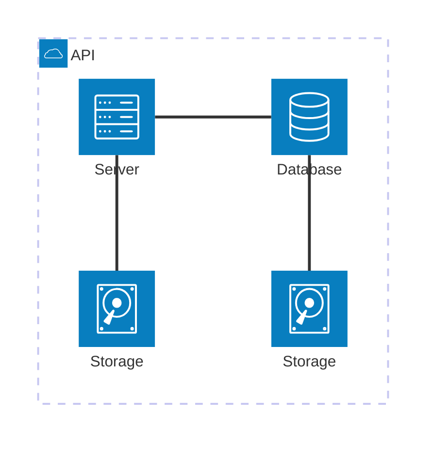

## Objetivo

O objetivo deste projeto é compreender os conceitos básicos sobre redes de computadores e trabalhar com uma plataforma de gerenciamento de hardware. A proposta é utilizar o MaaS (Metal as a Service) para gerenciar as máquinas e automatizar completamente os servidores físicos, garantindo uma operação eficiente. Para isso, dispositivos NUCs serão utilizados para montar a rede, com o MaaS facilitando o gerenciamento e a automação de toda a infraestrutura.

## Material Utilizado
1 NUC (main) com 10Gb e 1 SSD (120Gb)

1 NUC (server1) com 12Gb e 1 SSD (120Gb)

1 NUC (server2) com 16Gb e 2 SSD (120Gb+120Gb)

3 NUCs (server3, server4 e server5) com 32Gb e 2 SSD (120Gb+120Gb)

1 Switch DLink DSG-1210-28 de 28 portas

1 Roteador TP-Link TL-R470T+

## Criando e Usando a Infraestrutura

1. Conexão dos dispositivos e instalação do Ubuntu Server

    * Conectamos o roteador, o switch e os NUCs à rede.
    * Instalamos o Ubuntu Server 22.04.5 LTS no NUC principal.
    * Configuramos o IP estático para garantir o acesso remoto e não ter problema de sempre mudar.

2. Instalação e configuração do MaaS

    * Instalamos o MaaS (versão 3.5) para gerenciar o hardware do NUC principal.
``` bash
sudo snap install maas --channel=3.5/Stable
```
    * Configuramos o acesso remoto via SSH.
    * Habilitamos o DHCP no MaaS e desabilitamos no roteador. Agora o responsável pele distribuição de IPs é o MaaS.
    * Configuramos o DNS para apontar para o servidor do Insper, que será responsável por traduzir os nomes de domínio em endereços IP.

3. Configuração de NAT e protocolos

    * Configuramos o NAT para permitir que os dispositivos da rede local se comuniquem com o exterior, usando um único endereço IP público para todos
    * Definimos o protocolo TCP, que garante que os pacotes de dados enviados de um dispositivo cheguem corretamente ao destino

4. Deploy do Ubuntu 24.04 e instalação do PostgreSQL

    * Realizamos o deploy do Ubuntu 24.04 nos servidores via MaaS.
    * Instalamos o Postgres no Server2 para que seja um servidor de banco de dados que será usado para armazenar e gerenciar os dados da aplicação
    ``` bash
    sudo apt install postgresql postgresql-contrib -y
    ```
    * Criamos a base de dados necessária.
    ``` bash
    createdb -O cloud tasks
    ```
    * Configuramos o servidor para aceitar conexões remotas dentro da subnet do kit.


### Tarefa 1

Instalando o MAAS:

<!-- termynal -->


/// caption
Dashboard do MAAS
///

Conforme ilustrado acima, a tela inicial do MAAS apresenta um dashboard com informações sobre o estado atual dos servidores gerenciados. O dashboard é composto por diversos painéis, cada um exibindo informações sobre um aspecto específico do ambiente gerenciado. Os painéis podem ser configurados e personalizados de acordo com as necessidades do usuário.

### Tarefa 2

## App


### Tarefa 1

### Tarefa 2

Exemplo de diagrama



[Mermaid](https://mermaid.js.org/syntax/architecture.html){:target="_blank"}

## Questionário, Projeto ou Plano

Esse seção deve ser preenchida apenas se houver demanda do roteiro.

## Discussões

Quais as dificuldades encontradas? O que foi mais fácil? O que foi mais difícil?

## Conclusão

O que foi possível concluir com a realização do roteiro?
