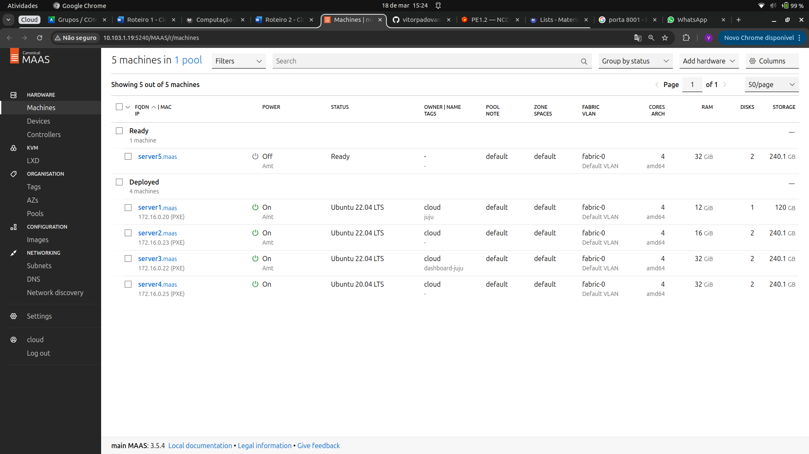
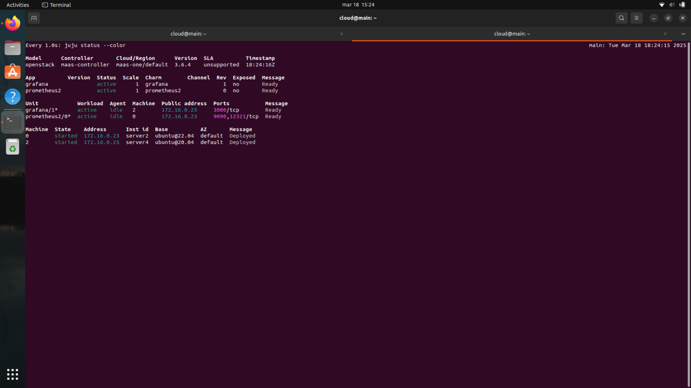
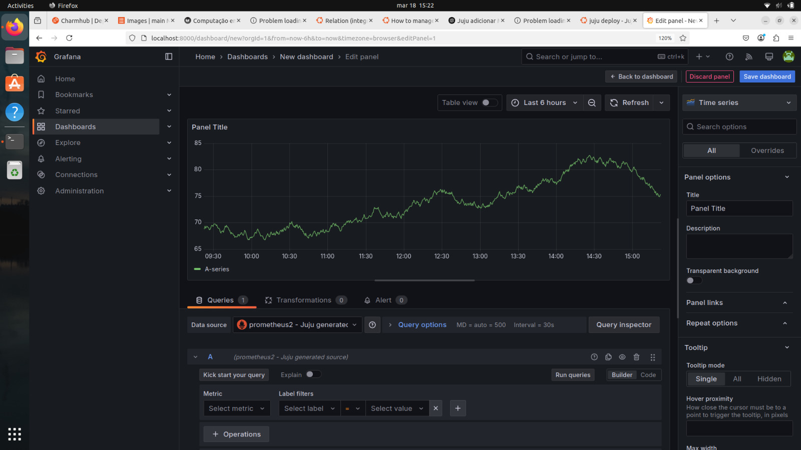
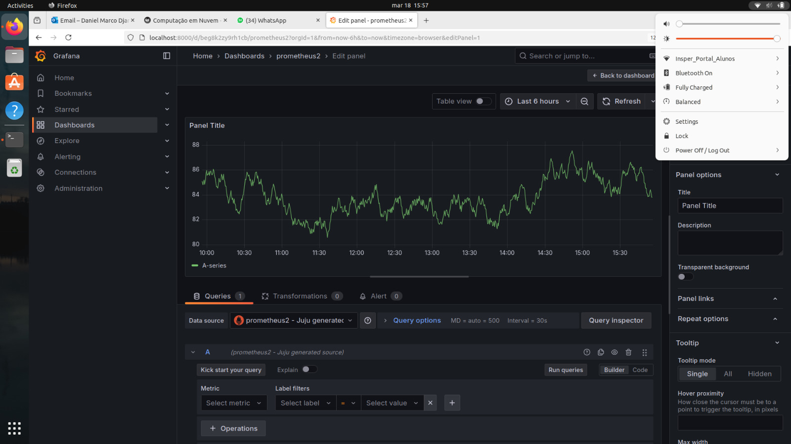
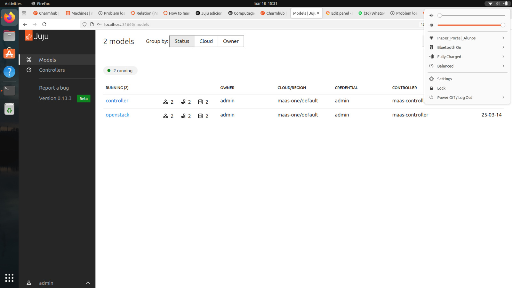

## Objetivo

Este roteiro tem como objetivo apresentar os fundamentos do Juju como uma plataforma de orquestração de deployment para aplicações distribuídas. 

O foco está em compreender como o Juju simplifica a configuração e o gerenciamento de serviços. Além disso, serão abordados os conceitos de comunicação entre aplicações e serviços, destacando como o Juju automatiza a interação entre os componentes de um sistema distribuído.

Para produção desse roteiro foi necessária a conclusão da etapa do Bare Metal (Roteiro 1) garantindo que a infraestrutura de base esteja configurada corretamente antes de seguir com a implementação do Juju.

## Material Utilizado
1 NUC (main) com 10Gb e 1 SSD (120Gb)

1 NUC (server1) com 12Gb e 1 SSD (120Gb)

1 NUC (server2) com 16Gb e 2 SSD (120Gb+120Gb)

3 NUCs (server3, server4 e server5) com 32Gb e 2 SSD (120Gb+120Gb)

1 Switch DLink DSG-1210-28 de 28 portas

1 Roteador TP-Link TL-R470T+   

## Criando a Infraestrutura

Nesta etapa, configuraremos o Juju para gerenciar a infraestrutura de servidores anteriormente ciradas e configuradas e que estão sendo gerenciados pelo MAAS.

Diferente do Ansible, que utilizamos para automatizar a instalação e configuração de serviços no roteiro anterior, o Juju consegue integrar-se diretamente ao MAAS, atuando como um orquestrador de deploy que provisiona e gerencia os recursos computacionais dinamicamente.

Fizemos o release do Postgres e Django do roteiro anterior, e iniciamos pela instalação do Juju.

### 1. Instalação e configuração do Juju
Utilizamos o Juju 3.6 para este roteiro, que será utilizado para gerenciar a infraestrutura de servidores.

``` bash
sudo snap install juju --channel 3.6
```

O Juju utilizará o MAAS para provedor de máquinas e sistema operacional, ou seja, haverá uma integração entre o Juju e o MAAS. Para isso, foi necessário configurá-lo para que possa exergar o MAAS. Foi feita a criação de dois arquivos para definição do cloud e do credential.

Primeiro criamos o arquivo `maas-cloud.yaml` que informa ao Juju onde encontrar o serviço MAAS e como ele deve se autenticar.
Utilizamos o endereço local e sua porta padrão para conexão que é 5240.

``` bash
clouds:
    maas-one:
        type: maas
        auth-types: [oauth1]
        endpoint: http://192.168.0.3:5240/MAAS/
```

Em seguida, importamos o arquivo de configuração para o Juju.

``` bash
juju add-cloud --client -f maas-cloud.yaml maas-one
```

Depois, criamos o arquivo `maas-creds.yaml` que contém as credenciais de acesso ao MAAS.
Necessário para que o Juju gerencie as máquinas dentro da cloud definida

``` bash
credentials:
    maas-one:
    anyuser:
        auth-type: oauth1
        maas-oauth: <API KEY>
```
OBS: **API KEY** é a chave que permite a autenticação, gerada dentro do MAAS, no menu do usuário

Em seguida, importamos o arquivo de credenciais para o Juju.

``` bash
juju add-credential --client -f maas-creds.yaml maas-one
```

### 2. Criando o controller do Juju

O Juju precisa de um controller, uma máquina exclusiva para gerenciar a orquestração dos serviços. Além disso, ele é o componente central que gerencia o ciclo de vida das aplicações. Ele é responsável por alocar máquinas, monitorar os serviços e gerenciar o deploy de novas aplicações.

Para isso, utilizaremos o server1, que deve foi marcado com a tag juju dentro do painel do MAAS.

``` bash
juju bootstrap --bootstrap-series=jammy --constraints tags=juju maas-one maas-controller
```

O parâmetro `--bootstrap-series=jammy` define a versão do sistema operacional que será utilizada (Ubuntu 22.04). O parâmetro `--constraints tags=juju` define que o controller será criado na máquina que possui a tag juju.

O comando acima demora um pouco para ser executado, porque diversas etapas são realizadas para configurar o controller, como:

* Provisionamento da máquina no MAAS

* Instalação do Juju

* Configuração do Juju para se conectar ao MAAS

* Testes de conectividade, e verificações finais

Por fim criamos o modelo 'openstack', que é o ambiente onde as aplicações serão instaladas.

Os modelos são ambientes isolados dentro de um controller, usados para organizar diferentes aplicações
    
``` bash
juju add-model --config default-series=jammy openstack
```


## Utilizando a Infraestrutura

Com o controller do Juju configurado, podemos começar a utilizar a infraestrutura de servidores para o deployment de aplicações. 

Nesta etapa, trabalharemos com duas aplicações essenciais para monitoramento: **Grafana** e **Prometheus**.
Sendo o Grafana responsável por **simplificar a apresentação visual de dados**, e o Prometheus por coletar e armazenar essas métricas, funcionando como um **banco de dados**. 

Com ambas instaladas, será possível acompanhar o desempenho e a integridade dos serviços em execução através de um **dashboard**.


### 1. Deploy do Grafana e Prometheus

Criamos uma pasta para armazenar os charms que serão utilizados no deploy das aplicações.

OBS: **Charms** são pacotes de software que contêm tudo o que é necessário para executar um serviço. Eles funcionam como scripts encapsulados que definem como uma aplicação deve ser instalada, gerenciada e integrada com outras

``` bash
mkdir -p /home/cloud/charms
cd /home/cloud/charms
```

Em seguida, baixamos os charms do Grafana e do Prometheus.

``` bash
juju download grafana
```

``` bash
juju download prometheus2
```

O deploy das aplicações foi feito com auxilio do Juju, utilizando o modelo 'openstack' criado anteriormente.
Isso foi importante para que não sobrecarregássemos o controller com a instalação de aplicações em um único modelo.

Além disso, fizemos o **deploy** do Prometheus e do Grafana **em máquinas diferentes** (server2 e server4, respectivamente), para garantir que os serviços não competissem por recursos.

``` bash
juju deploy ./prometheus2_XXX.charm
```

``` bash
juju deploy ./grafana_XXX.charm
```

OBS: **XXX** é a versão do charm, que no caso foi r69

Apesar disso, tivemos um problema com o deploy do Grafana, pois a versão do charm não enxergava a imagem do ubuntu 22.04, que era a versão utilizada nas máquinas. Para resolver, o próprio Juju instalou a versão 20.04. No entanto, para concluir o processo, foi necessário utilizar a flag no comando de deploy para garantir que o processo fosse concluído.

``` bash
juju deploy ./grafana_r69.charm --base ubuntu@20.04
```

### 2. Integração entre Grafana e Prometheus

No Juju, uma integração é uma conexão entre duas ou mais aplicações. Essa conexão é estabelecida devido ao fato de uma aplicação ter um endpoint (ponto de comunicação) específico que permite a interação com outras aplicações.

Grafana pode se conectar ao Prometheus através de uma relação, onde o Prometheus expõe métricas e o Grafana as consome para exibir visualmente.

Para isso, é necessário configurar o Prometheus como um **data source** no Grafana.

``` bash
juju integrate prometheus2:grafana–source grafana:grafana-source 
```

### 3. Acessando o Grafana

Para acessar o Grafana rodando no server4 por meio de um túnel SSH. Criamos uma conexão segura entre o nosso localhost e o server4, utilizando a funcionalidade de redirecionamento de portas do SSH. 

Esse túnel permite que o tráfego da porta 8001 no nosso computador local seja redirecionado para a porta 3000 no server4, onde o Grafana está ouvindo, como se estivesse rodando localmente em nossa máquina.

``` bash
ssh cloud@10.103.1.19 -L 8001:[IP server4]:3000
```

Assim, ao acessar o endereço `http://localhost:8001` no navegador, conseguimos visualizar o Grafana.

OBS: Para conseguir acessar o Grafana, foi necessário pegar a senha gerada pelo Juju e inserir no login.

``` bash
juju run grafana/1 get-admin-password
```

Por fim, criamos um novo dashboard no Grafana, onde adicionamos o Prometheus como data source.

### Tarefa 1
Verificando se a integração foi feita corretamente


/// caption
Dashboard do MAAS com as máquinas
///


/// caption
Estado atual de todos os deployments no Juju
///


/// caption
Tela do Dashboard do Grafana com o Prometheus como source
///


/// caption
Acesso remoto ao Dashboard a partir da rede do Insper
///


/// caption
Aplicações sendo gerenciadas pelo JUJU
///