## Objetivo

Criar uma Private Cloud com OpenStack

Para esse projeto, vamos criar uma Cloud privada. Para isso vamos instalar vários softwares para deixar a cloud funcional.

Os softwares serão instalados em máquinas, sempre buscando distribuir as cargas entre as máquinas. Para isso, utilizaremos o Juju, que é um software de orquestração de containers. O Juju é um software que permite gerenciar aplicações em nuvem, como OpenStack, Kubernetes, etc.

## Infraestrutura

Para iniciar o roteiro 3, precisamos criar novamente as bridges, dentro do maas, para que as máquinas virtuais possam receber IPs.

Como no roteiro passado, vamos criar um controller na máquina 1, para isso criamos uma tag `juju` que referencia a máquina 1.

``` bash
juju bootstrap --bootstrap-series=jammy --constraints tags=juju maas-one maas-controller
```

Definimos o modelo openstack que vai ser utilizado para fazer o deploy.
``` bash
juju add-model --config default-series=jammy openstack
```
``` bash
juju switch maas-controller:openstack
```

Criamos o dashboard do juju dentro de uma máquina virtual em cima da máquina 0, para isso utilizamos o controller criado anteriormente. Foram também integrados o juju-dashboard com o controller e exposto para a rede.

``` bash
juju deploy juju-dashboard --to lxd:0
```

OBS: Lembrando que o lxd é um docker que tem ubuntu ativo, serve para criar uma maquina virtual em cima de uma máquina física.

``` bash
juju integrate juju-dashboard controller
```

``` bash
juju expose juju-dashboard
```

Instalação do Ceph OSD que funciona como um software que unificará todas os HDs das máquinas para criar um storage distribuído. Esse software é justamente o que vai permitir que os usuários consigam ver apenas uma unidade de armazenamento, mesmo que na verdade sejam várias máquinas com vários HDs. Para isso, utilizamos o charm do ceph-osd.

Para isso criamos tags específicas para três máquinas que vão ser utilizadas para o ceph, no caso as máquinas 3, 4 e 5. Essas tags são compute.

``` bash
juju deploy -n 3 --channel quincy/stable --config ceph-osd.yaml --constraints tags=compute ceph-osd
```

Quando o workload do ceph estiver blocked e o agent estiver idle, significa que ele esta esperando o deploy de um novo software.

Nova compute funciona para prover instancias de novas unidades de armazenamento. Fizemos a alteração do arquivo `nova-compute.yaml` com a seguinte configuração:
``` bash
nova-compute:
  config-flags: default_ephemeral_format=ext4
  enable-live-migration: true
  enable-resize: true
  migration-auth-type: ssh
  virt-type: qemu
```

``` bash
juju deploy -n 3 --to 0,1,2 --channel yoga/stable --config nova-compute.yaml nova-compute
```

Para criação do mysql, utilizamos o charm do mysql, que é um banco de dados relacional. O charm do mysql é utilizado para armazenar os dados do openstack. Para ele funcionar, precisamos também de 3 máquinas

``` bash
juju deploy -n 3 --to lxd:0,lxd:1,lxd:2 --channel 8.0/stable mysql-innodb-cluster
```


Após isso, precisamos criar o banco de dados do openstack, para isso utilizamos o charm do mysql-router. O mysql-router é um software que faz a comunicação entre o banco de dados e o openstack. Fizemos a instalação do Vault, que é um software de gerenciamento de senhas. O Vault é um repositório de chaves que é utilizado para criptografar a comunicação entre aplicações cloud, ou seja, ele guarda as chaves para todas as comunicações entre aplicações do openstack.

``` bash
juju deploy --to lxd:2 vault --channel 1.8/stable
```

``` bash
sudo snap install vault
```


Inicializamos o vault, para isso precisamos de um token de inicialização. O token é gerado pelo vault e é utilizado para autenticar o usuário. O token é gerado apenas uma vez e deve ser guardado em um local seguro. Para isso, utilizamos o comando `juju run-action` que executa um comando em uma máquina específica.

``` bash
export VAULT_ADDR="http://172.16.0.30:8200"
vault operator init -key-shares=5 -key-threshold=3
```
  
``` bash
juju run vault/leader authorize-charm token=XXX
```
OBS: O XXX é o token gerado pelo vault, como exemplo *s.QMhaOED3UGQ4MeH3fmGOpNED*

Fizemos a implementação da Neutron networking, que fornece a conexão de rede no OpenStack. Ela é responsável pelo gerenciamento da rede para as máquinas virtuais e outros recursos.
Inicialmente, criamos pontes para as máquinas (br-ex) pelo maas
A flat-network-providers habilita uma rede sem VLANs. Isso é essencial para acessar redes externas, como a Internet.
A ovn-bridge-mappings liga a bridge OVS (br-ex) ao provedor de rede

OVN aplicação é ovn-central e requer 3 máquinas

``` bash
juju deploy -n 3 --to lxd:0,lxd:1,lxd:2 --channel 22.03/stable ovn-central
```

Neutron-api em contêiner LXD no nó 1

``` bash
juju deploy --to lxd:1 --channel yoga/stable --config neutron.yaml neutron-api
```

Após isso, foi feito o deploy do charm das aplicações com o neutron-api-plugin-ovn e ovn-chassis charm

``` bash
juju deploy --channel yoga/stable neutron-api-plugin-ovn
juju deploy --channel 22.03/stable --config neutron.yaml ovn-chassis
```

E suas respectivas relações que servem para conectar os softwares, ou seja, para que eles consigam se comunicar entre si.

``` bash
juju integrate neutron-api-plugin-ovn:neutron-plugin neutron-api:neutron-plugin-api-subordinate
juju integrate neutron-api-plugin-ovn:ovsdb-cms ovn-central:ovsdb-cms
juju integrate ovn-chassis:ovsdb ovn-central:ovsdb
juju integrate ovn-chassis:nova-compute nova-compute:neutron-plugin
juju integrate neutron-api:certificates vault:certificates
juju integrate neutron-api-plugin-ovn:certificates vault:certificates
juju integrate ovn-central:certificates vault:certificates
juju integrate ovn-chassis:certificates vault:certificates
```

Por fim conectamos o neutron-api com a base de dados do OpenStack

``` bash
juju deploy --channel 8.0/stable mysql-router neutron-api-mysql-router
juju integrate neutron-api-mysql-router:db-router mysql-innodb-cluster:db-router
juju integrate neutron-api-mysql-router:shared-db neutron-api:shared-db
```

O Keystone é o serviço de identidade do OpenStack. Ele é responsável por autenticar usuários, fornecer tokens, e fazer o controle de acesso, para isso ele faz a troca do par de chaves.

```bash
juju deploy --to lxd:0 --channel yoga/stable keystone
```

Interligamos o keystone com a base de dados

```bash
juju deploy --channel 8.0/stable mysql-router keystone-mysql-router
juju integrate keystone-mysql-router:db-router mysql-innodb-cluster:db-router
juju integrate keystone-mysql-router:shared-db keystone:shared-db
```

```bash
juju integrate keystone:identity-service neutron-api:identity-service
juju integrate keystone:certificates vault:certificates
```

O RabbitMQ é o serviço de mensageria do OpenStack. Ele é responsável por enviar mensagens entre os serviços do OpenStack

```bash
juju deploy --to lxd:2 --channel 3.9/stable rabbitmq-server
```

```bash
juju integrate rabbitmq-server:amqp neutron-api:amqp
juju integrate rabbitmq-server:amqp nova-compute:amqp
```

Nova Cloud Controller coordena as ações de provisionamento de máquinas virtuais. Ele é responsável por criar, excluir e gerenciar instâncias de máquinas virtuais.

Para isso, definimos que o gerenciador de rede é o Neutron

```bash
nova-cloud-controller:
  network-manager: Neutron
```

```bash
juju deploy --to lxd:2 --channel yoga/stable --config ncc.yaml nova-cloud-controller
```

Interligando o nova-cloud-controller com a base de dados

```bash
juju deploy --channel 8.0/stable mysql-router ncc-mysql-router
juju integrate ncc-mysql-router:db-router mysql-innodb-cluster:db-router
juju integrate ncc-mysql-router:shared-db nova-cloud-controller:shared-db
```

OBS: nova-cloud-controller-mysql-router = ncc-mysql-router

```bash
juju integrate nova-cloud-controller:identity-service keystone:identity-service
juju integrate nova-cloud-controller:amqp rabbitmq-server:amqp
juju integrate nova-cloud-controller:neutron-api neutron-api:neutron-api
juju integrate nova-cloud-controller:cloud-compute nova-compute:cloud-compute
juju integrate nova-cloud-controller:certificates vault:certificates
```

O serviço Placement do OpenStack é responsável por rastrear os recursos físicos disponíveis, como CPU, memória e armazenamento. Ele fornece informações sobre a disponibilidade de recursos para os serviços do OpenStack

```bash
juju deploy --to lxd:0 --channel yoga/stable placement
```

Interligando o placement com a base de dados

```bash
juju deploy --channel 8.0/stable mysql-router placement-mysql-router
juju integrate placement-mysql-router:db-router mysql-innodb-cluster:db-router
juju integrate placement-mysql-router:shared-db placement:shared-db
```

```bash
juju integrate placement:identity-service keystone:identity-service
juju integrate placement:placement nova-cloud-controller:placement
juju integrate placement:certificates vault:certificates
```

Horizon também foi instalado. Ela é a interface web usada para gerenciar os serviços do OpenStack de forma visual. 

```bash
juju deploy --to lxd:2 --channel yoga/stable openstack-dashboard
```

```bash
juju deploy --channel 8.0/stable mysql-router dashboard-mysql-router
juju integrate dashboard-mysql-router:db-router mysql-innodb-cluster:db-router
juju integrate dashboard-mysql-router:shared-db openstack-dashboard:shared-db
```

```bash
juju integrate openstack-dashboard:identity-service keystone:identity-service
juju integrate openstack-dashboard:certificates vault:certificates
```

O Glance é o serviço de gerenciamento de imagens de disco no OpenStack. Ele permite que usuários armazenem, descubram e recuperem imagens de máquinas virtuais.

```bash
juju deploy --to lxd:2 --channel yoga/stable glance
```

Interligando o glance com a base de dados

```bash
juju deploy --channel 8.0/stable mysql-router glance-mysql-router
juju integrate glance-mysql-router:db-router mysql-innodb-cluster:db-router
juju integrate glance-mysql-router:shared-db glance:shared-db
```

```bash
juju integrate glance:image-service nova-cloud-controller:image-service
juju integrate glance:image-service nova-compute:image-service
juju integrate glance:identity-service keystone:identity-service
juju integrate glance:certificates vault:certificates
```

O Ceph Monitor é o serviço responsável por manter a visão consistente e distribuída do cluster de armazenamento Ceph. Ele rastreia o estado dos OSDs (Object Storage Daemons) e ajuda a coordenar as operações entre os nós de armazenamento, além de monitorar a saúde do cluster.

```bash
ceph-mon:
  expected-osd-count: 3
  monitor-count: 3
```

OBS: Composto por três nós e que deve esperar pelo menos três OSDs

```bash
juju deploy -n 3 --to lxd:0,lxd:1,lxd:2 --channel quincy/stable --config ceph-mon.yaml ceph-mon
```

```bash
juju integrate ceph-mon:osd ceph-osd:mon
juju integrate ceph-mon:client nova-compute:ceph
juju integrate ceph-mon:client glance:ceph
```

O Cinder é o serviço de armazenamento em bloco do OpenStack. Ele fornece volumes de armazenamento que podem ser anexados a instâncias de máquinas virtuais. Essa etapa consiste em configurar o serviço principal e integrá-lo com Ceph como backend.

A configuração do cinder é feita através de um arquivo YAML, onde definimos o backend de armazenamento e a versão da API do Glance.

```bash
cinder:
  block-device: None
  glance-api-version: 2
```

```bash
juju deploy --to lxd:1 --channel yoga/stable --config cinder.yaml cinder
```

```bash
juju deploy --channel 8.0/stable mysql-router cinder-mysql-router
juju integrate cinder-mysql-router:db-router mysql-innodb-cluster:db-router
juju integrate cinder-mysql-router:shared-db cinder:shared-db
```

Essas próximas relações conectam o Cinder com os serviços principais do OpenStack: identidade (Keystone), imagens (Glance), mensageria (RabbitMQ), orquestração de volumes (Nova), e certificados (Vault)

```bash
juju integrate cinder:cinder-volume-service nova-cloud-controller:cinder-volume-service
juju integrate cinder:identity-service keystone:identity-service
juju integrate cinder:amqp rabbitmq-server:amqp
juju integrate cinder:image-service glance:image-service
juju integrate cinder:certificates vault:certificates
```

Para que o Cinder use o Ceph como backend:

```bash
juju deploy --channel yoga/stable cinder-ceph
```

```bash
juju integrate cinder-ceph:storage-backend cinder:storage-backend
juju integrate cinder-ceph:ceph ceph-mon:client
juju integrate cinder-ceph:ceph-access nova-compute:ceph-access
```

O Ceph RADOS Gateway (RGW) é um serviço de armazenamento de objetos que fornece uma interface compatível com S3 e Swift. Ele funciona como alternativa ao serviço OpenStack Swift ou Amazon S3.

```bash
juju deploy --to lxd:0 --channel quincy/stable ceph-radosgw
```

Integrando o Ceph RADOS Gateway com o cluster do Ceph. Essa relação conecta o gateway aos monitores do Ceph, permitindo o gerenciamento de pools e autenticação de usuários S3/Swift

```bash
juju integrate ceph-radosgw:mon ceph-mon:radosgw
```

Por fim, como a aplicação do Ceph-OSD já foi realizada, precisamos fazer a integração dele para finalizar a etapa de configuração da infraestrutura. A relação proposta vai funcionar para configuração do charm para uso do disco `/dev/sdb`, que vai ser utilizado para armazenamento.

```bash
juju config ceph-osd osd-devices='/dev/sdb'
```

## Setup

Iremos agora configurar os serviços que controlam as Virtual Machines, o Volume de Disco e a Estrutura de Rede Virtual
Primeiro, vamos carregar as variáveis de ambiente e se autenticar no OpenStack

Para isso, utilizamos o comando `openrc` que é um script que carrega as variáveis de ambiente necessárias para autenticação. O script é gerado pelo OpenStack e deve ser baixado na interface web do OpenStack.

```bash
sudo snap install openstackclients
```

Baixamos o arquivo direto da interface web do OpenStack e configuramos o ambiente do usuário administrador

```bash
wget https://docs.openstack.org/project-deploy-guide/charm-deployment-guide/latest/_downloads/c894c4911b9572f0b5f86bdfc5d12d8e/openrc
```

```bash
source ~/openrc
```

```bash
env | grep OS_
```

Para entrada no OpenStack dashboard fizemos um túnel SSH para acessar o dashboard do OpenStack.

```bash
ssh cloud@10.103.0.X -L 8001:172.16.0.39:80
```

O acesso ao dashboard é feito pelo navegador, acessando o endereço `http://localhost:8001` e utilizando o usuário admin e a senha obtido pelo `env | grep OS_`

### Tarefa 1
Verificando se o acesso ao Dashboard do OpenStack está funcionando, ou seja, se conseguimos acessar a interface web do OpenStack.


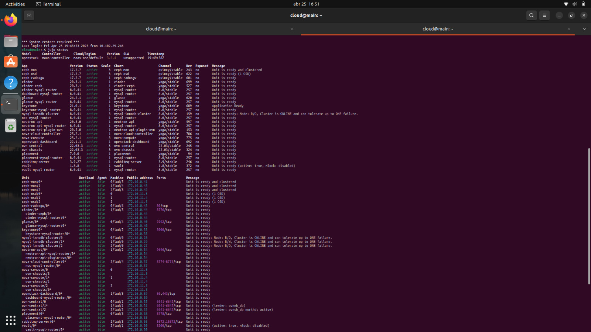
/// caption
Status do JUJU
///

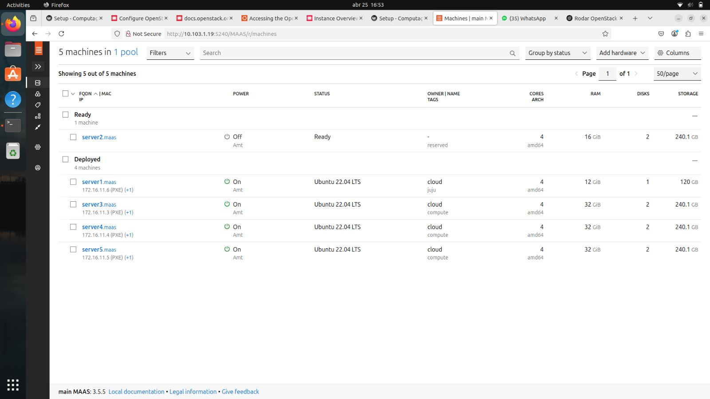
/// caption
Dashboard do MAAS com as máquinas
///

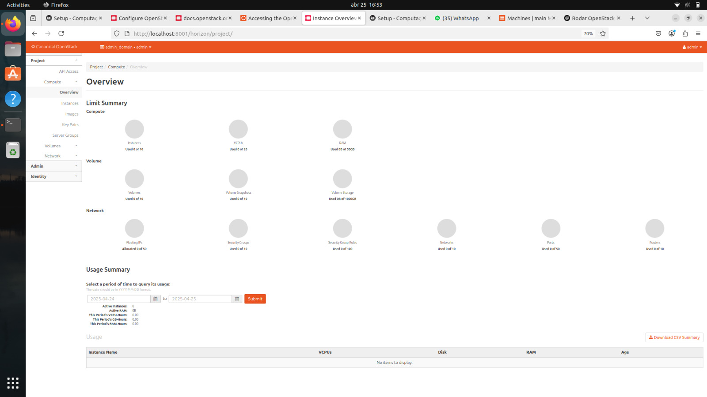
/// caption
Aba compute overview no OpenStack Dashboard
///

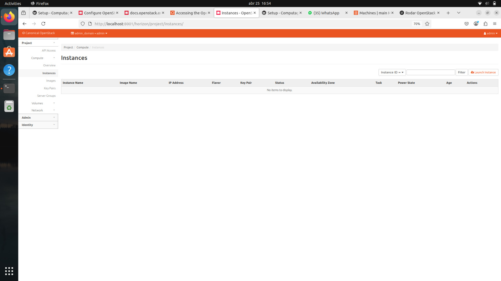
/// caption
Aba compute instances no OpenStack Dashboard
///

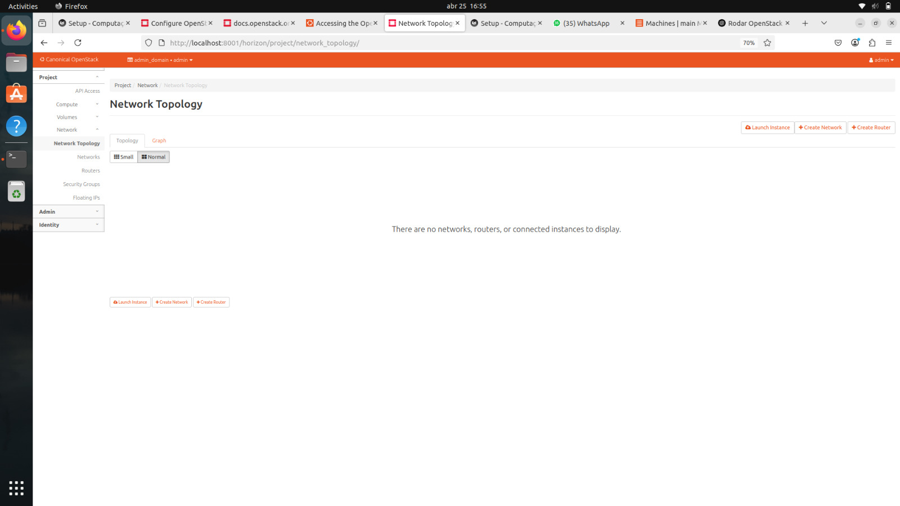
/// caption
Aba network topology no OpenStack Dashboard
///

Criamos o cliente via snap, carregamos o openrc e verificamos se o cliente está funcionando


```bash
source openrc
```

```bash
openstack service list
```

Além disso, fizemos pequenos ajustes de rede
```bash
juju config neutron-api enable-ml2-dns="true"
juju config neutron-api-plugin-ovn dns-servers="172.16.0.1"
```

Carregamos a imagem do Ubuntu 22.04 no OpenStack, para isso utilizamos o comando `openstack image create` que cria uma imagem no OpenStack. O comando é utilizado para criar uma imagem de disco que pode ser utilizada para criar instâncias de máquinas virtuais.

```bash
mkdir ~/cloud-images

wget http://cloud-images.ubuntu.com/jammy/current/jammy-server-cloudimg-amd64.img \
   -O ~/cloud-images/jammy-amd64.img
```

```bash
openstack image create --public --container-format bare \
   --disk-format qcow2 --file ~/cloud-images/jammy-amd64.img \
   jammy-amd64
```

Para definir um perfil de hardware para a imagem, utilizamos o comando `openstack flavor create` que cria um perfil de hardware no OpenStack. O comando pode ser utilizado para criar instâncias de máquinas virtuais.

```bash
openstack flavor create --ram 1024 --disk 20 --vcpus 1 m1.tiny
```

```bash
openstack flavor create --ram 2048 --disk 20 --vcpus 1 m1.small
```

```bash
openstack flavor create --ram 4096 --disk 20 --vcpus 2 m1.medium
```

```bash
openstack flavor create --ram 8192 --disk 20 --vcpus 4 m1.large
```

OBS: O parâmetro `--ram` define a quantidade de memória RAM da instância e o parâmetro `--disk` define o tamanho do disco da instância. Todos esses foram configurados de acordo com a tabela abaixo:

| Nome do perfil | vCPUs | Ram (GB) | Disk |
|----------------|----------|------------|---------------------|
| m1.tiny        | 1     | 1         | 20                  |
| m1.small       | 1     | 2         | 20                  |
| m1.medium      | 2     | 4         | 20                  |
| m1.large       | 4     | 8        | 20                 |


Criando a rede externa, que é a rede que vai permitir o acesso à internet. Para isso, utilizamos o comando `openstack network create` que cria uma rede no OpenStack. O comando é utilizado para criar uma rede externa que pode ser utilizada para conectar as instâncias de máquinas virtuais à internet.

```bash
openstack network create --external --share- \
   --provider-network-type flat -provider-physical-network physnet1 \
    ext_net
```

E uma sub-rede externa, que é a sub-rede que vai permitir o acesso com o comando `openstack subnet create` que cria uma sub-rede no OpenStack. O comando é utilizado para criar uma sub-rede externa que pode ser utilizada para conectar as instâncias de máquinas virtuais à internet.

```bash
openstack subnet create --network ext_net --no-dhcp \
   --gateway 172.16.0.1 --subnet-range 172.16.0.0/20 \
   --allocation-pool start=172.16.7.0,end=172.16.8.255 \
   ext_subnet
```

Criando uma rede interna, que é a rede que vai permitir a comunicação entre as instâncias de máquinas virtuais. Para isso, utilizamos o comando `openstack network create` que cria uma rede no OpenStack. O comando é utilizado para criar uma rede interna que pode ser utilizada para conectar as instâncias de máquinas virtuais.

```bash
openstack network create --internal user1_net
```

E uma sub-rede interna, que é a sub-rede que vai permitir a comunicação entre as instâncias de máquinas virtuais com o comando `openstack subnet create` que cria uma sub-rede no OpenStack. O comando é utilizado para criar uma sub-rede interna que pode ser utilizada para conectar as instâncias de máquinas virtuais.

```bash
openstack subnet create --network user1_net  \
   --subnet-range 192.169.0.0/24 \
   --allocation-pool start=192.169.0.10,end=192.169.0.100 \
   user1_subnet
```

Por fim adicionamos a rota do user1 a subnet criada

```bash
openstack router create user1_router
openstack router add subnet user1_router user1_subnet
openstack router set user1_router --external-gateway ext_net
```

Para verificar se está tudo funcionando, criamos uma instância que como teste prático do ambiente completo que configuramos. Em outras palavras, ela é o primeiro "cliente" real da nuvem que montamos.

```bash
openstack server create --image jammy-amd64 --flavor m1.tiny \
   --key-name user1 --network user1_net --security-group Allow_SSH \
   client
```

Além disso, alocamos um IP flutuante para a instância criada, que é o IP que vai ser utilizado para acessar a instância de fora da nuvem. Agora teremos um IP externo e um IP interno.

```bash
FLOATING_IP=$(openstack floating ip create -f value -c floating_ip_address ext_net)
openstack server add floating ip client $FLOATING_IP
```

### Tarefa 2
Verificando se o acesso ao Dashboard do OpenStack está funcionando, ou seja, se conseguimos acessar a interface web do OpenStack.

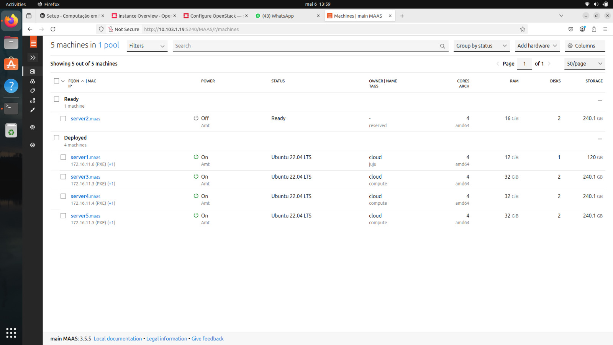
/// caption
Dashboard do MAAS com as máquinas
///

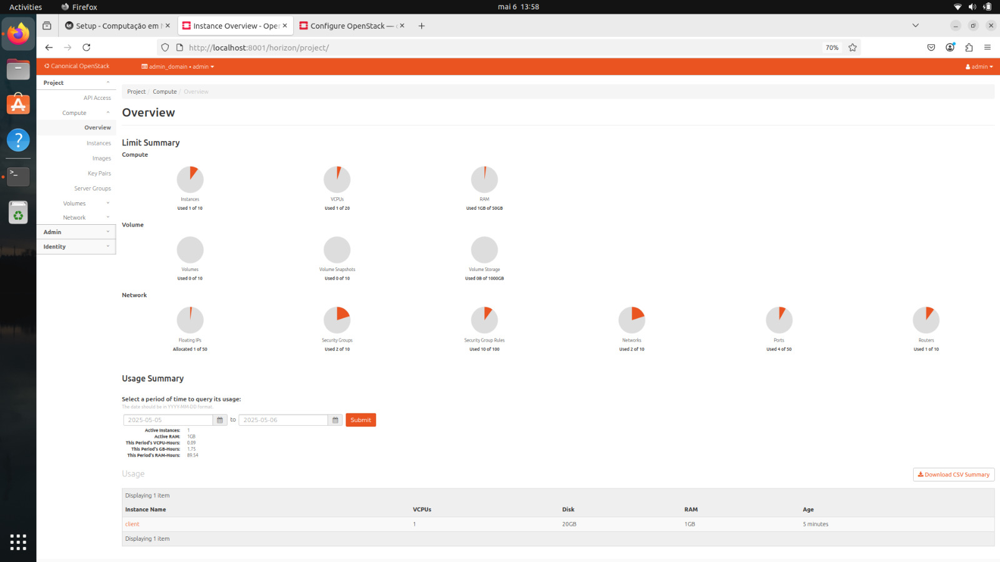
/// caption
Aba compute overview no OpenStack
///

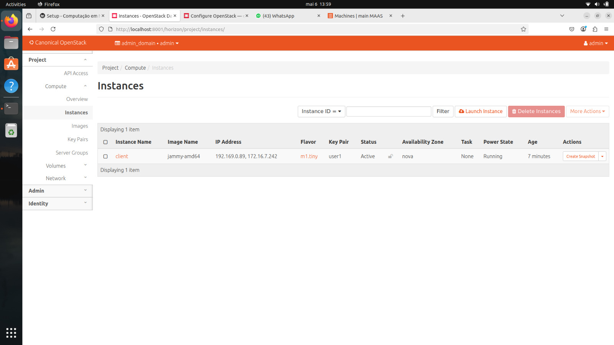
/// caption
Aba compute instances no OpenStack
///

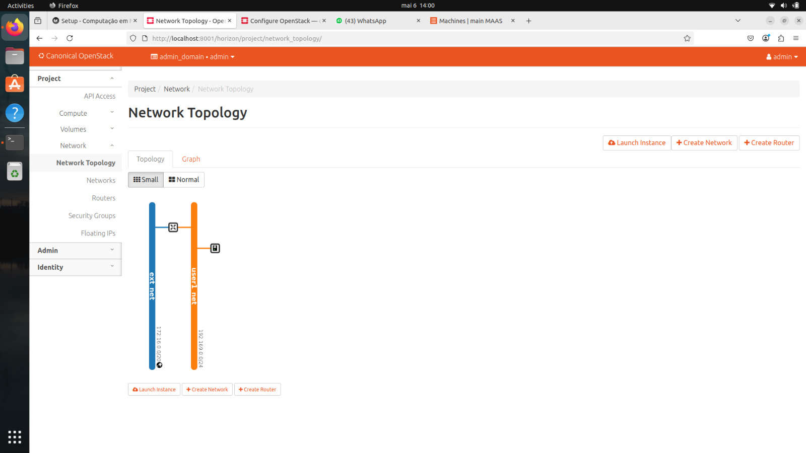
/// caption
Aba network topology no OpenStack
///

#### Diferenças encontradas entre os prints das telas na Tarefa 1 e na Tarefa 2

**Instâncias:**

Na Tarefa 1, o painel mostra nenhuma instância criada, pois o ambiente ainda não foi completamente configurado.

Na Tarefa 2, já existe uma instância do tipo m1.tiny chamada client, indicando que os recursos de computação foram corretamente configurados e utilizados.

**Topologia de Rede:**

Na Tarefa 1, a topologia está vazia, com ausência de redes, roteador e associações entre eles.

Na Tarefa 2, a topologia exibe demonstra que toda a estrutura lógica de rede está funcional visto que:

   - A rede ext_net (azul) com faixa 172.16.0.0/24 representa a rede externa, usada para acesso público via Floating IP.

   - A rede user1_net (laranja) com faixa 192.168.0.0/24 é a rede interna, onde ficam as instâncias.

   - Um roteador foi criado conectando as duas redes, permitindo roteamento entre instâncias privadas e a rede externa.

**Overview:**

Na Tarefa 1, os gráficos e métricas indicam zero uso de vCPUs, RAM e disco, refletindo a ausência de workloads ativos.

Na Tarefa 2, essas métricas apresentam uso compatível com a instância m1.tiny ativa, evidenciando o provisionamento correto dos recursos de infraestrutura

#### Como os recursos foram criados

- Instância client:

A instância client foi criada utilizando, especificando a imagem, flavor e key pair, utilizamos também o m1.tiny que é o mais leve pois não é necessário muito recurso. Por fim foi alocado um IP flutuante para acesso externo.

- Rede e sub-rede:

Foram criadas duas redes no OpenStack: ext_net (externa, faixa 172.16.0.0/24) e user1_net (interna, faixa 192.168.0.0/24).

- Conexão:

A conexão entre as redes foi feita através de um roteador, que conecta a rede interna à externa, permitindo comunicação entre instâncias e acesso à internet.


Com a máquina nova, que estava reservada, iremos adicionar um novo nó de computação. O objetivo é preparar o ambiente para alta disponibilidade, maior desempenho e capacidade.

```bash
juju add-unit nova-compute
```

Além disso, convertemos o mesmo nó também em um nó de armazenamento .

```bash
juju add-unit --to <machine-id> ceph-osd
```
Usamos a maquina 3, que já estava reservada para isso. 

### Tarefa 3

Nossa estrutura de rede nesse momento está assim:


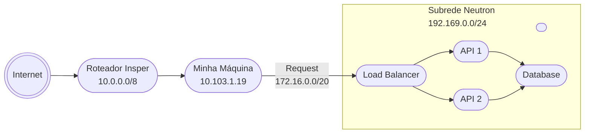


## Uso da Infraestrutura

Para utilizar a infraestrutura criada, precisamos criar uma máquina virtual para cada tarefa especificada. Foi solicitado 2 instâncias com a API do projeto, etapa 1; 1 instância com banco de dados, etapa 1, e; 1 instância com LoadBalancer, Nginx.

Para isso, fizemos novamente IPs flutuantes para cada instância criada, e utilizamos o mesmo processo de criação de instâncias que foi utilizado anteriormente. Apenas nesse início iremos continuar com todos os IPs externos, para podermos verificar se tudo está funcionando corretamente. Após os testes e instalações dos softwares, iremos retirar os IPs externos e deixar apenas no load balancer, para que possamos acessar o serviço de forma externa.

Primeiro instalamos o docker em cada uma das máquinas virtuais que iriam receber as APIs, para isso utilizamos os seguintes comandos:

```bash
# Add Docker's official GPG key:
sudo apt-get update
sudo apt-get install ca-certificates curl
sudo install -m 0755 -d /etc/apt/keyrings
sudo curl -fsSL https://download.docker.com/linux/ubuntu/gpg -o /etc/apt/keyrings/docker.asc
sudo chmod a+r /etc/apt/keyrings/docker.asc

# Add the repository to Apt sources:
echo \
  "deb [arch=$(dpkg --print-architecture) signed-by=/etc/apt/keyrings/docker.asc] https://download.docker.com/linux/ubuntu \
  $(. /etc/os-release && echo "${UBUNTU_CODENAME:-$VERSION_CODENAME}") stable" | \
  sudo tee /etc/apt/sources.list.d/docker.list > /dev/null
sudo apt-get update
```

```bash
sudo apt-get install docker-ce docker-ce-cli containerd.io docker-buildx-plugin docker-compose-plugin
```

Após isso, baixamos e rodamos a imagem do docker hub

```bash
sudo docker pull vitorpadova/projeto_cloud
```

```bash
docker run -d -p 8080:80 vitorpadova/projeto_cloud
```

Para ver se a imagem está rodando, utilizamos o comando:

```bash
sudo docker ps -a
```

Fizemos o mesmo processo para a máquina que vai receber o banco de dados, mas nesse caso utilizamos a imagem do Postgres.

Depois de instalar o docker, baixamos a imagem do Postgres e rodamos o container com o seguinte comando:

```bash
sudo docker run --env-file .env vitorpadova/projeto_cloud
```


O mesmo processo foi feito para o LoadBalancer, mas nesse caso utilizamos a imagem do Nginx.

Depois de tudo, ligamos o LoadBalancer com as APIs e o Banco de Dados, para isso criamos um arquivo de configuração env com as variáveis de ambiente necessárias para o funcionamento.


Por fim, removemos os IPs flutuantes das instâncias, exceto do LoadBalancer, para que possamos acessar o serviço de forma externa.

```bash
openstack server remove floating ip client $FLOATING_IP
```


### Tarefa 4

Verificando se o app está funcionando.

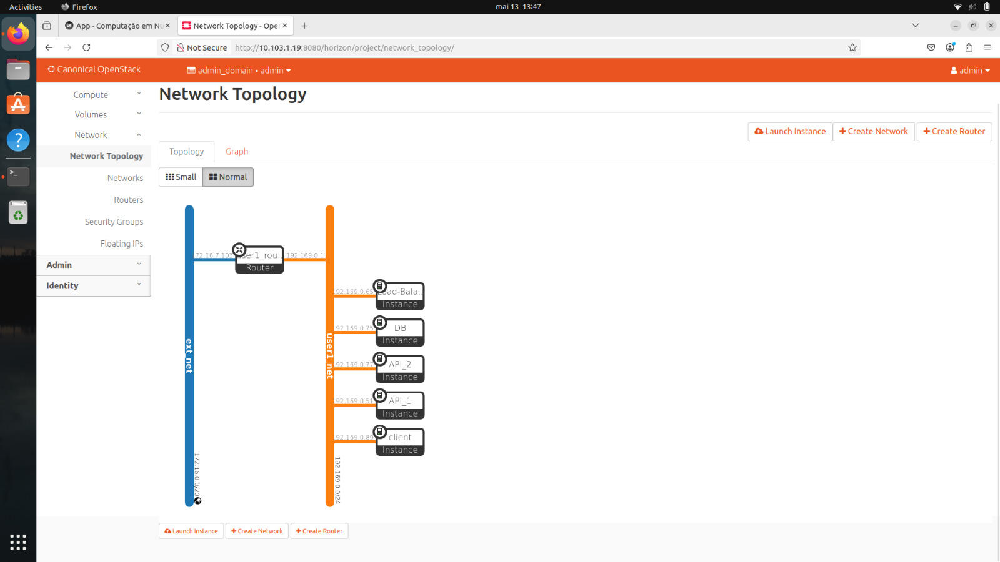
/// caption
Arquitetura de rede da infraestrutura
///

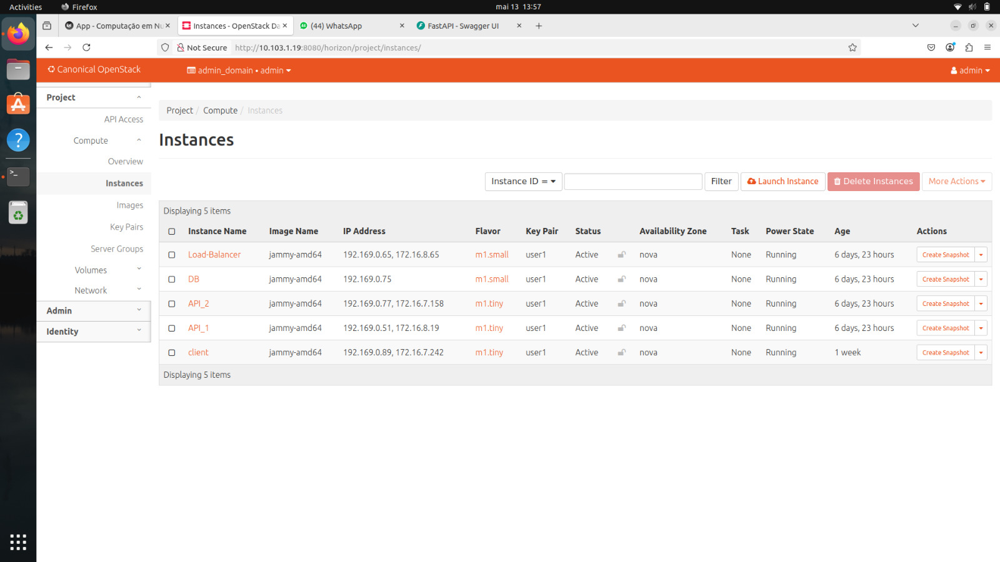
/// caption
Lista de VMs utilizadas com nome e IPs alocados
///

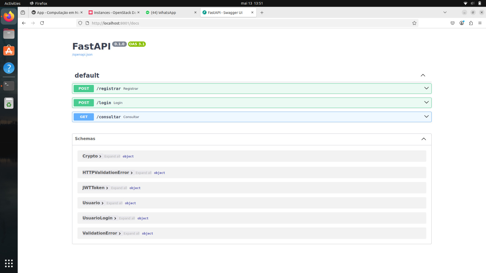
/// caption
Dashboard do FastAPI conectado via máquina Nginx/LB
///

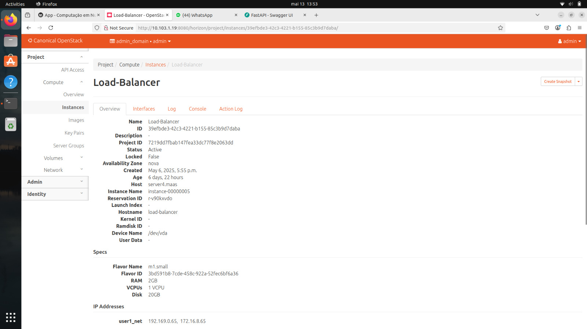
/// caption
Server (máquina física) que Load Balancer foi alocado pelo OpenStack
///

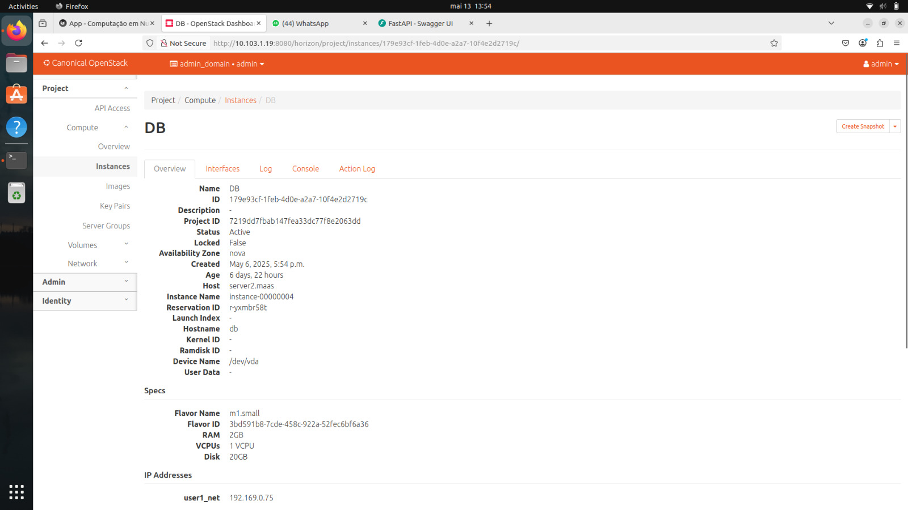
/// caption
Server (máquina física) que Base de Dados foi alocada pelo OpenStack
///

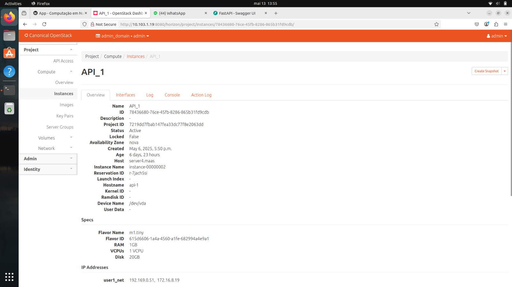
/// caption
Server (máquina física) que API 1 foi alocada pelo OpenStack
///


/// caption
Server (máquina física) que API 2 foi alocada pelo OpenStack
///