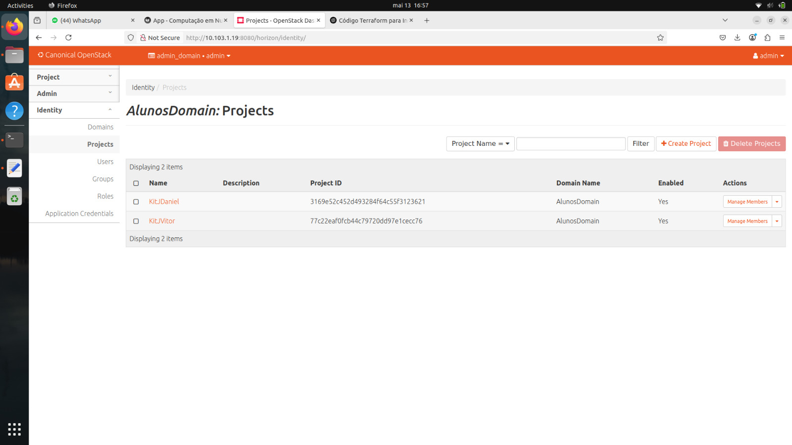
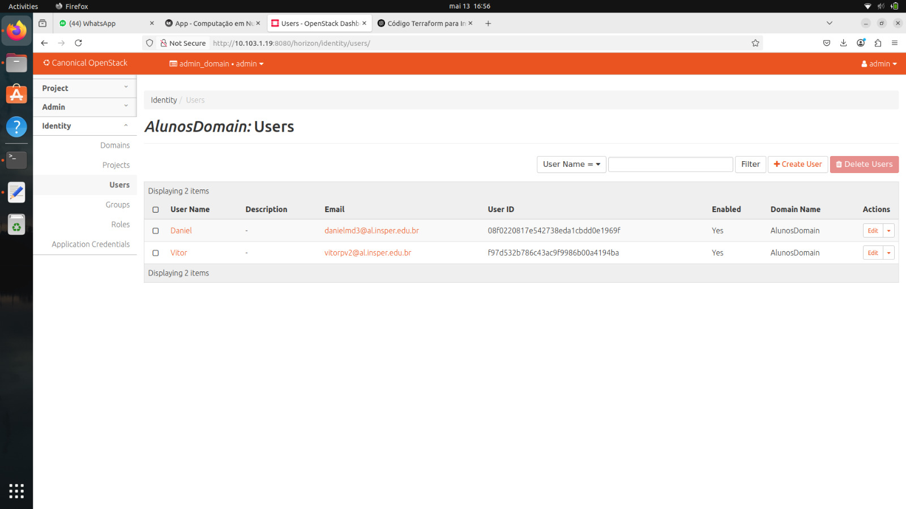
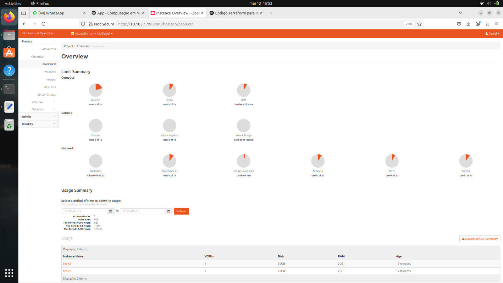
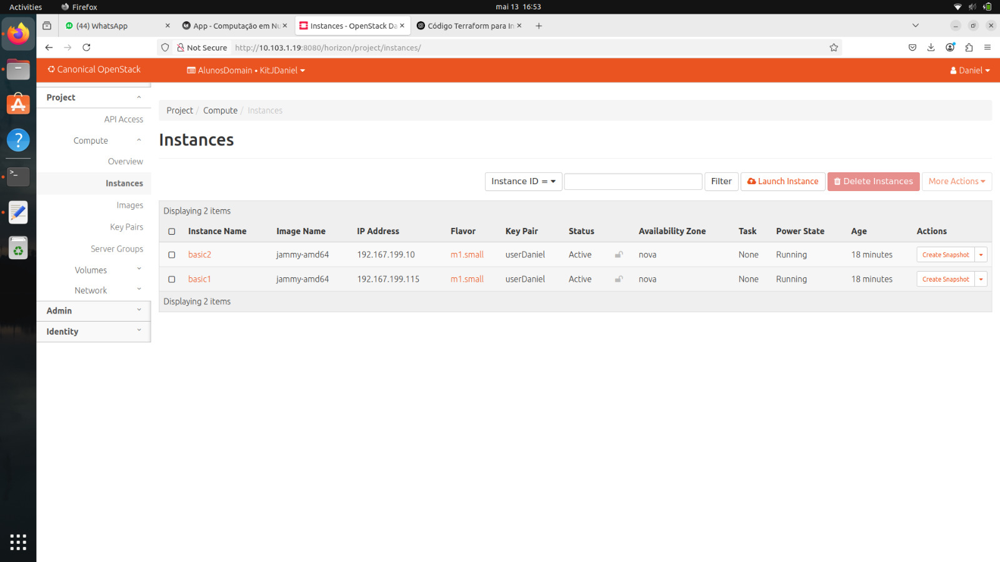
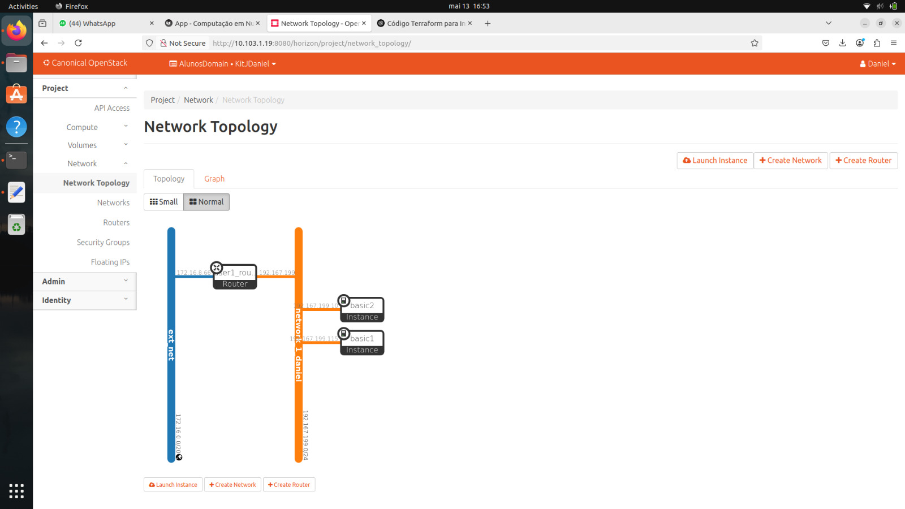
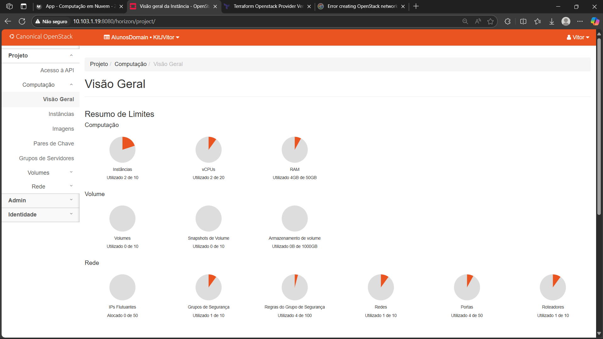
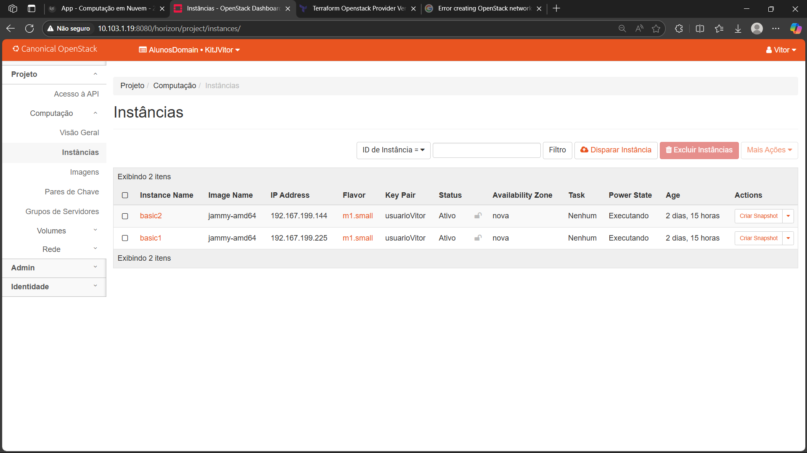
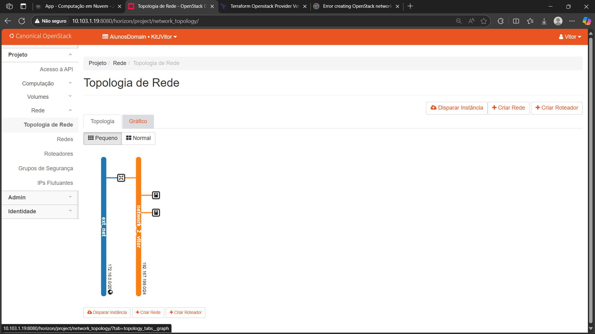

## Objetivo

1. Compreender os fundamentos de Infraestrutura como Código (IaC) e sua importância em ambientes de nuvem.

2. Entender os conceitos básicos de SLA (Service Level Agreement) e DR (Disaster Recovery) e como eles se relacionam

3. Aplicar os conceitos aprendidos em uma prática de criação de infraestrutura automatizada, organizada em hierarquias de projeto e aplicações isoladas, ou seja, criar uma infraestrutura em cloud com esse script

## Descrição

Infraestrutura como Código (IaC) é uma abordagem que permite gerenciar e provisionar recursos de infraestrutura por meio de código, em vez de processos manuais. Isso traz agilidade, consistência e escalabilidade para ambientes de nuvem. Portanto para processos de subir uma máquina virtual, criar um banco de dados ou configurar uma rede, o IaC permite que esses processos sejam realizados de forma automatizada e repetível.


Terraform é uma ferramenta de IaC que permite criar uma infraestrutura em cloud. Para isso, ele precisa ter as chaves e senhas para poder criar os recursos. Portanto ele disponibiliza arquivos scripts que são utilizados para criar a infraestrutura desejada. Esses arquivos são escritos em HCL (HashiCorp Configuration Language), uma linguagem declarativa que permite descrever a infraestrutura de forma simples.

Instalando o Terraform

```bash
wget -O- https://apt.releases.hashicorp.com/gpg | gpg --dearmor | sudo tee /usr/share/keyrings/hashicorp-archive-keyring.gpg

gpg --no-default-keyring --keyring /usr/share/keyrings/hashicorp-archive-keyring.gpg --fingerprint

echo "deb [signed-by=/usr/share/keyrings/hashicorp-archive-keyring.gpg] https://apt.releases.hashicorp.com $(lsb_release -cs) main" | sudo tee /etc/apt/sources.list.d/hashicorp.list

sudo apt update && sudo apt install terraform
```

## Infraestrutura 

Agora que você já tem o Terraform instalado, vamos criar uma infraestrutura em cloud. Para isso, vamos criar utilizando códigos.

Será necessário criar um Domínio, dois projetos e um usuário "Aluno", tudo isso via dashboard do OpenStack, Horizon.

Criamos um domínio chamado "AlunosDomain", um projeto pra cada aluno chamado "KitJDaniel" e "KitJVitor", e dois usuários, um chamado "Daniel" e outro "Vitor", adicionamos emails/senhas e atribuímos papéis de "admin" para o domínio e projeto.

## Aplicativo

Para criar o aplicativo, vamos utilizar o Terraform. Para cada Aluno, criamos uma pasta com o nome do aluno, e dentro dela criamos alguns arquivos para criar a infraestrutura desejada.

Primeiro, vamos criar um arquivo chamado `provider.tf`, que é o arquivo que contém as informações de conexão com o OpenStack. Esse arquivo deve conter as seguintes informações:

```bash
terraform {
  required_providers {
    openstack = {
      source  = "terraform-provider-openstack/openstack"
      version = "~> 3.0.0"
    }
  }
}

provider "openstack" {
  region              = "RegionOne"
  user_name           = "SEU_USUARIO"
}
```

Agora, vamos criar um arquivo chamado `instance1.tf`, que é o arquivo que contém as informações da instância que queremos criar. Esse arquivo deve conter as seguintes informações:

```bash
resource "openstack_compute_instance_v2" "basic" {
  name            = "basic"
  image_id        = "d9d79a26-88a1-4e63-8c07-4c733a0b94c2"
  flavor_id       = "3bd591b8-7cde-458c-922a-52fec6bf6a36"
  key_pair        = "user1"
  security_groups = ["default"]

  network {
    name = "network_1"
  }
}
```

OBS: Cada aluno criou um nome diferente para a rede, então é necessário alterar o nome da rede para o nome que você criou. Para isso, basta alterar a linha `name = "network_1"` para o nome da rede que você criou.

Fizemos a mesma coisa para o arquivo `instance2.tf`, que é o arquivo que contém as informações da instância que queremos criar. Esse arquivo deve conter as seguintes informações:

Para o router, vamos criar um arquivo chamado `router.tf`, que é o arquivo que contém as informações do roteador que queremos criar. Esse arquivo deve conter as seguintes informações:

```bash
  GNU nano 6.2                                                        router.tf                                                                 resource "openstack_networking_router_v2" "router_2" {
  name                = "user2_router"
  admin_state_up      = true
  external_network_id = "dc9a9a31-6c93-4eb5-9525-9db2cfe89b4d"
}

resource "openstack_networking_router_interface_v2" "int_2" {
  router_id = openstack_networking_router_v2.router_2.id
  subnet_id = openstack_networking_subnet_v2.subnet_2.id
}
```

Por fim, com o terraform instalado e os arquivos criados, vamos criar a infraestrutura. Para isso, basta executar os seguintes comandos:

```bash
terraform init
terraform plan
terraform apply
```

Após executar o comando `terraform apply`, o Terraform irá criar a infraestrutura desejada. Para verificar se a infraestrutura foi criada corretamente, basta acessar o dashboard do OpenStack e verificar se as instâncias foram criadas corretamente.

## Exercícios Alunos em Conjunto


/// caption
Aba Identity projects no OpenStack
///


/// caption
Aba Identity users no OpenStack
///

## Exercícios Aluno 1


/// caption
Aba compute overview no OpenStack Dashboard
///


/// caption
Aba compute instances no OpenStack Dashboard
///


/// caption
Aba network topology no OpenStack Dashboard
///


## Exercícios Aluno 2



/// caption
Aba compute overview no OpenStack Dashboard
///


/// caption
Aba compute instances no OpenStack Dashboard
///


/// caption
Aba network topology no OpenStack Dashboard
///


## Plano de Disaster Recovery e SLA (Exercício)

Considerando um cenário em que somos o CTO (Chief Technology Officer) de uma grande empresa com sede em várias capitais no Brasil e precisamos implantar um sistema crítico, de baixo custo e com dados sigilosos para a área operacional.

1. Public Cloud ou Private Cloud?
    - A empresa deve optar por uma Private Cloud, pois os dados são sigilosos e a empresa não pode correr o risco de vazamento de dados. Além disso, a empresa possui um grande número de servidores e pode manter uma infraestrutura própria.

2. Por que a empresa precisa de um time de DevOps?
    - A empresa precisa de um time de DevOps para garantir que a infraestrutura esteja sempre disponível e funcionando corretamente. Além disso, o time de DevOps é responsável por automatizar os processos de implantação e gerenciamento da infraestrutura, garantindo agilidade e eficiência.

3. Plano de DR (Disaster Recovery) e HA (Alta Disponibilidade)
    - As principais ameaças são: 
      - Queda de energia ou falha de hardware em datacenters regionais

      - Ataques cibernéticos como ransomware ou vazamento de dados operacionais

      - Erros humanos em atualizações manuais ou configurações incorretas

      - Falhas de rede

      - Indisponibilidade de recursos de cloud ou fornecedores externos

4. Ações para a recuperação de seu ambiente em uma possível interrupção/desastre
    - Backup diário dos dados e configuração da infraestrutura

    - Monitoramento constante da infraestrutura e dos serviços

    - Testes periódicos de recuperação de desastres

    - Treinamento da equipe para lidar com situações de emergência

5. Política de backup
    - A política de backup deve ser definida de acordo com a criticidade dos dados e serviços. Os backups devem ser realizados diariamente e armazenados em locais diferentes da infraestrutura principal. Além disso, os backups devem ser testados periodicamente para garantir que estão funcionando corretamente.	

6. Alta disponibilidade implementada na infraestrutura
    - A alta disponibilidade deve ser implementada por meio de redundância de hardware e software. Isso pode ser feito por meio de clusters de servidores, balanceadores de carga e replicação de dados. Além disso, a infraestrutura deve ser monitorada constantemente para garantir que os serviços estejam sempre disponíveis.